# Developer Guide

# Table of content
<!-- TOC -->
* [1. Introduction](#1-introduction)
    + [1.1. Purpose](#11-purpose)
    + [1.2. Product Scope](#12-product-scope)
        - [1.2.1. Target User Profile](#121-target-user-profile)
        - [1.2.2. Value Proposition](#122-value-proposition)
    + [1.3. Definitions](#13-definitions)
* [2. Design & Implementation](#2-design--implementation)
    * [2.1. Project Overview](#21-project-overview)
        * [2.2. Module Overview](#22-module-overview)
            * [2.2.1. Record module ](#221-sam-record-module)
            * [2.2.2. Converter module ](#222-converter-module)
            * [2.2.3. BRANDON storage module ](#223-brandon-storage-module)
            * [2.2.4. Command module ](#224-command-module)
            * [2.2.5. Parser Module ](#225-parser-module)
                * [2.2.5.1. Object creation and input interpretation](#2251-object-creation-and-steps-in-input-interpretation)
                * [2.2.5.2. Design Considerations ](#2252-design-considerations)
* [3. User Stories](#3-user-stories)
* [4. Non-functional requirements](#4-non-functional-requirements)
* [5. Instructions for manual testing](#5-instructions-for-manual-testing)
    + [5.1, Startup, shutdown and restart](#51-startup-shutdown-and-restart-with-saved-list)
    + [5.2. Adding a patient](#52-adding-a-patient)
    + [5.3. Deleting a patient](#53-delete-a-patient)
        
<!-- TOC -->

## 1. Introduction

### 1.1. Purpose
This document specifies the architecture and software designs for 
Hospital Administrative Management System (HAMS).

### 1.2. Product Scope
#### 1.2.1. Target User Profile
The intended audience of this documentation are the developers, designers, software testers,
operators and maintenance engineers. The below table summarizes the purposes of reading for each 
audience.

|Role|Purpose|
|---------|-------|
|Developers & Designers| To understand the architecture and follow the design to build the system|
|Software testers| To understand the internals of the system so as to test more effectively|
|Operators| To improve productivity while using the system on a daily basis|
|Maintenance Engineers| To understand how the system was built in order to perform enhancement or re-engineering work|

#### 1.2.2. Value Proposition
We are focused on providing a user-friendly application for front-desk administrative support assistants to quickly create, edit
and delete patients' information and appointments. 

|Stakeholders|Value|
|------------|-----|
|Patients|Accelerated waiting process|
|Front-desk administrative staff|Improved organisation in patient and appointment details. Potential automated notification processes |

### 1.3. Definitions
|Term|Description|
|----|-----------|
|||
|||

### [Back to top &#x2191;](#table-of-content)

## 2. Design & Implementation
### 2.1 Project overview
HAMS is built using java. Under java's write once run anywhere, HAMS can be built on any platform including Windows,
MAC-OS and Linux. When running locally on these system, HAMS uses as custom save configuration called 
BRillant Ahead of its time Neat Dainty OrigiNal (BRANDON) for loading and saving data. This allows HAMS' internal 
list to be modified by operators before and during run time. 

### 2.2 Module Overview
The major code can be broken down into modules. The below table is the breakdown of the module's custom
name and a summarized purpose.

**TODO**

|Module name|Purpose|
|---------|-------|
|Records|Contains and provides access to user information|
|Converter|Formats user input| 
|BRillant Ahead of its time Neat Dainty OrigiNal (BRANDON) **Storage**|?|
|Commands|Facade classes that deals with input so that different classes can interact with each other|
|Parser|Parses the user input for command execution|

#### 2.2.1 Record module

The record module consists of 2 classes which represent the patients information and appointment details. 
As a reflection of real world objects, the Patient's class purpose is to store the particulars of a person while the 
Appointment's class is to store the date-time data. 
Thus, the rationale of both classes can be grouped as follows:

>
> As a reflection of real world entities, to create, store, and retrieve relevant information about the object.
>

Following the above purpose, both classes consist of only getter and setter methods. This would ensure a contiguous 
flow in logical executions as these methods can be called whenever necessary.

##### 2.2.1.1 Process of Object Creation
Due to the nature of the above classes containing only getter and setter methods, following how the components interact 
with each other would provide more accuracy in understanding how these classes are called and the role of its 
methods. 
To illustrate, the below example is used:
* editp \index 1 \name Justin \age 69 \Pasir Panjang

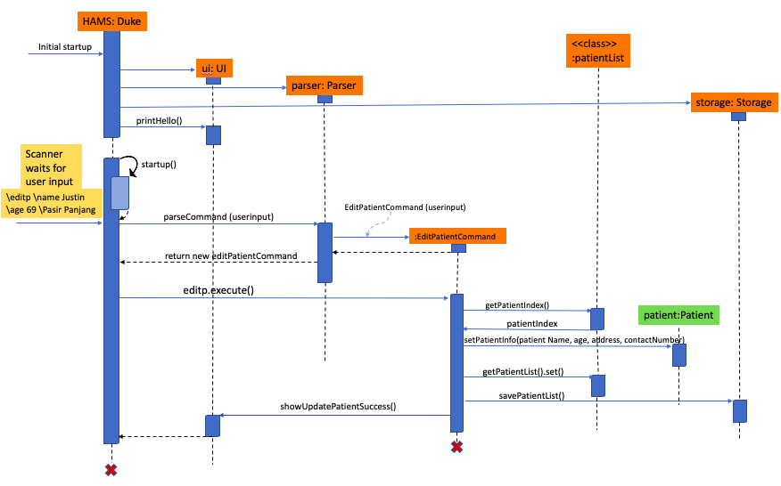

Upon startup, objects from ui, parser and storage are created. Prompted for user input, Duke receives the "editp"
command which is forwarded to the parser to be interpreted respectively. Once the `EditPatientCommand` object is 
created, it retrieves the patient index to edit the existing patient information from the patientList. 
The `Patient` class is called by its setter method, `setPatientInfo()`, to update the fields as provided by the user. 
This ensures that the encapsulated variables such as age, name, contact number and address are not only enforced but
also protected. 

##### 2.2.1.2 Design Considerations
###### Aspect: Data Type for Appointment's Date and Time

+ Alternative 1 (current choice): Store as a String
    * Pros: 
        - Easier implementation
        - Greater user flexibility
    * Cons:
        -  Cannot sort if needed

+ Alternative 2: Store as Date
    * Pros:
        - Has flexibility to parse or format date using existing methods available for use.
    * Cons:
        - Immutable-value classes mean it is not thread-safe (using Java.util.SimpleDateFormat).

### [Back to top &#x2191;](#table-of-content)

#### 2.2.2 Converter Module
The converter module consists of one class which converts the format of date and time using a custom format defined by
special formatting characters (ie. SimpleDateFormat). This class is primarily used to format a user-input date and time
in the `Appointment` class. As illustrated below, its methods are called during the creation of the `Appointment`
object constructor. 

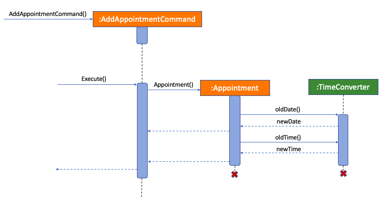

### [Back to top &#x2191;](#table-of-content)

#### 2.2.3 BRANDON storage module

The Storage module consists of 3 different classes. 
The PatientList and AppointmentList classes act as data structures to store the records of Patient and Appointment 
objects respectively. They function as ADTs, where various commands from Command objects can manipulate the records within.
The Storage class manages the load and save operations involving the PatientList and PatientList class. 
These operations are usually invoked on startup, whenever changes are made to the ADTs and before exiting the program.
The class diagram for the storage module is as seen below: 


&nbsp;

On startup, Duke invokes the loadSavedAppointment() and loadSavedPatient() methods in Storage. This allows the program 
to retrieve previously stored data from a .txt file and convert it into the static AppointmentList and PatientList objects for use
within the program. 

The Storage object creates a Scanner object that will parse individual lines in the .txt file, convert them into
new Appointments, and then add them to an ArrayList called `appointmentListToReturn`. This `appointmentListToReturn` will be passed back to Duke to
construct the static AppointmentList. The sequence diagram is shown below:

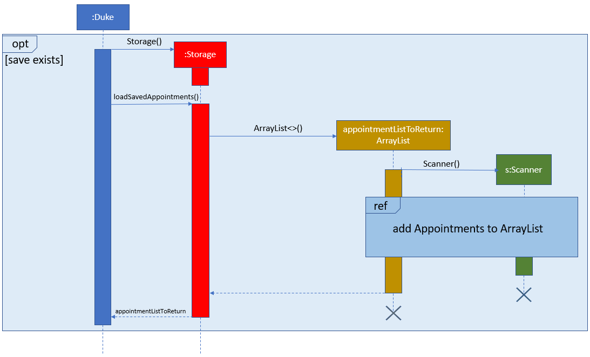
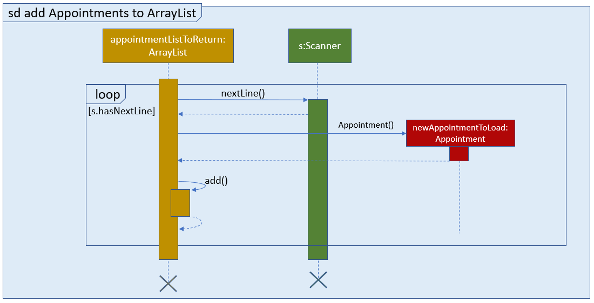

When the static AppointmentList or PatientList has changes, or the program is exiting, saveAppointmentList() or savePatientList() 
is invoked respectively. This allows the Storage object to back up existing records to a local .txt file.

The Storage object will create a FileWriter object called `fw`. The command will then iterate through the existing AppointmentList
and parse each Appointment within, converting it to a string. `fw` then writes this string to the .txt file.
The sequence diagram is shown below:


#####2.2.3.1 FindPatient/FindAppointment
Design considerations for findPatient:
- general search
- include multiple fields in search

Design considerations for findAppointment:
- using specified formats for date and time, only allow one to be searched at any time
- general search


### [Back to top &#x2191;](#table-of-content)

#### 2.2.4 Command module 

The command module consist of 11 different classes, where each class does a different command by itself. 
These classes allows the patients and appointments to be added into HAMS, allows the updating of patient and 
appointment details, allows the admin to delete patients and appointment information and allows of listing of the 
different patients and the appointments in HAMS. In addition, the classes also deals with displaying the list of 
commands and as well as to allowing HAMS to exit.


All of these command classes inherits from the abstract ```Command``` class. Likewise, the execute function of each 
command  class is also inherited from the abstract ```Command``` class's ```execute(Ui ui, Storage storage)``` function 
too. Every command class (other than the  ```ExitCommand``` and ```HelpCommand```) are actually façade classes that 
creates the connection from the ```Main``` class to the other classes required such as ```Storage``` class,
```PatientList``` class and the ```Appointment``` class to name a few. 

##### 2.2.4.1 AddPatientCommand Class

To add a patient, the ```AddPatientCommand``` class is used. For this ```AddPatientCommand``` class, it serves as the 
façade class for the ```Main```, ```Patient``` , ```PatientList``` and the ```Storage``` class to interact with one 
another. Also, to uniquely identify a patient, an unique patientId number is assigned to each patient when they are first added into the patient list.

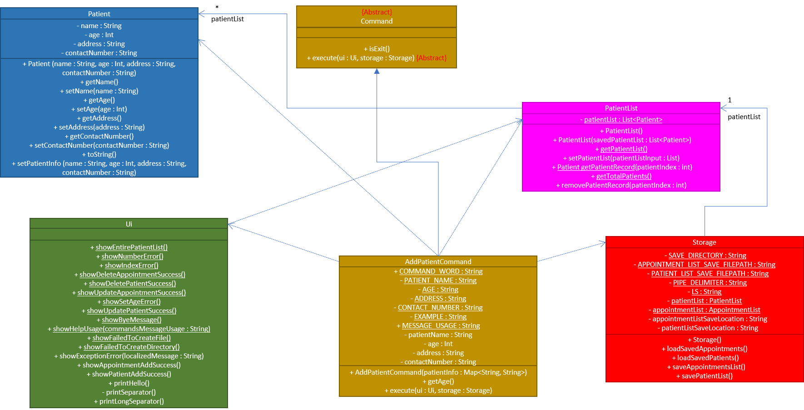

1. The ```AddPatientCommand``` class object will first be created by the ```Parser``` object, where the information 
regarding the patient to be added will be stored in a Map, where the ```AddPatientCommand``` class object would read the Map content and store the information about the patient in said ```AddPatientCommand``` class object. 
For the patient Id number, it will call upon the static class ```patientIdManager``` to get its unique patient id number. This unique Id number will be used later in the ```Patient``` object creation too.

2. When the 
```execute(Ui ui, Storage storage)``` command is called, the  ```AddPatientCommand``` would first make use of the 
```Patient``` class constructor to create a new ```Patient``` object based on the information stored back in step 1. 

3. After which, it would then call the 
```PatientList```’s ```getPatientList()``` command to get the ```List``` patient list object such that the ```Patient``` 
object created beforehand can directly be inserted into the patient list. 

4. After adding the patient into the patient list 
object, the ```Storage```’s ```savePatientList()``` function will be called next so that the newly update list of 
```patient``` is saved as offline data.  

5. When the above operation is successful, it will call upon the ```Ui``` class’ 
```showPatientAddSuccess()``` function to display the success of adding the ```Patient``` object into the patient list.

If the supplied patient age is a word or is missing, the age will be set to ```-1```. This value is chosen to indicate 
that there isn’t a valid age set. Thus, when displaying the age, if ```-1``` is encountered, show age as an empty string 
instead.

Below shows the sequence diagram for ```AddPatientCommand``` class


##### 2.2.4.2 AddAppointmentCommand Class

To add an appointment, the ```AddAppointmentCommand``` class is used. For this ```AddAppointmentCommand``` class, it 
serves as a façade class for the ```Main```, ```Appointment```, ```AppointmentList``` and the ```Storage``` class to 
interact with one another. 

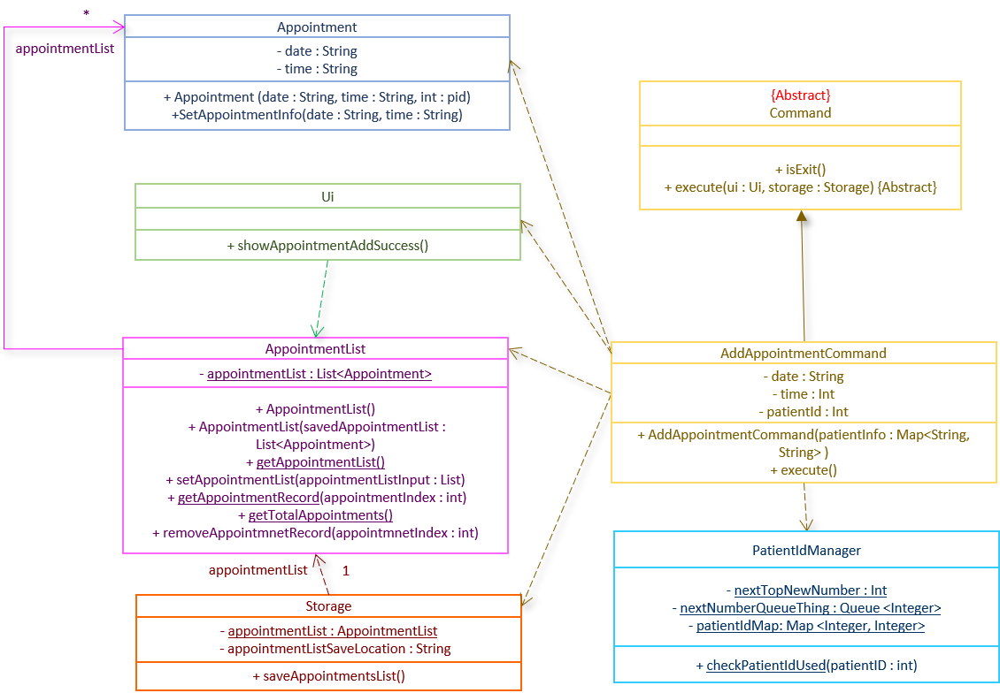

1. Like the ```AddPatientCommand``` class, the ```AddAppointmentCommand``` object is first created by the ```Parser``` 
object, where the information of the appointment is again stored in a Map that the ```AddAppoinmentCommand``` object would read from. 
Said information will be stored in the ```AddAppoinmentCommand``` object

2. When 
the ```Main``` calls ```execute(Ui ui, Storage storage)```, the ```AddAppointmentCommand``` class would call upon the 
```Appointment``` class to make an ```Appointment``` Object. Note that in the the constructor of ```AddAppointment``` it also checks to see if the patient id is a patient id that actually exist (as in a patient has that patient id
). This check is done by calling the ```checkPatientIdUsed``` method of ```PatientIdManager``` class. If the patient id
 supplied with the appointment detail does not belong to any of the present patients, the ```AddAppointmentCommand``` 
 constructor will **not** create the ```Appointment```  and will show an error instead. The ```Appointment``` object
  will only be created if the patient id that is supplied exists (as in one of the patient has said patient id).

3. After which, the ```AddAppoinmentCommand``` object will 
call upon the ```AppointmentList``` object to obtain the list of ```Appointments``` (get the ```List``` object that 
represents the list of appointments by ```AppointmentList```’s ```getAppointmentList()``` command) so that it can 
directly add the new ```Appointment``` object into the appointment list. 

4. Finally, it will call upon the ```Storage``` 
class’s ```saveAppoinmentList()``` function to save the updated appointment list. 

5. Upon successfully adding the 
```Appointment``` object into the appointment list, it will call upon the ```Ui``` class’ 
```showAppointmentAddSuccess()``` function to display the success of adding the ```appointment``` into the appointment 
list.

Below shows the sequence diagram for ```AddAppointmentCommand``` class:


##### 2.2.4.3 ListPatientCommand Class

To display the list of patients, the ```ListPatientCommand``` class is called. This class serves as a façade class of 
```Main``` and ```Ui``` to interact with each other. 

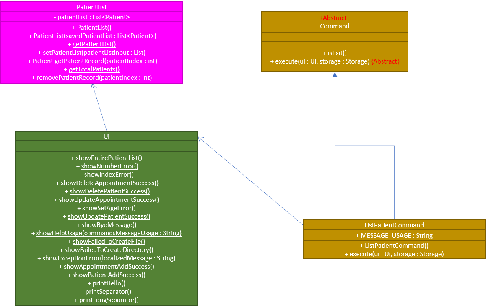

1. This class' object is first created by the ```Parser``` class, where it is then returned to the ```Main``` class to have its
```execute(Ui ui, Storage storage)``` function be called. 

2. When the ```Main``` class calls the 
```execute(Ui ui, Storage storage)``` function, ```ListPatientCommand``` will call upon the ```Ui```’s 
```showEntirePatientList()``` function to display the list of patients.

Below shows the sequence diagram for ```ListPatientCommand``` class


##### 2.2.4.4 ListAppointmentCommand Class

To display the list of appointments, the ```ListAppointmentCommand``` class is called. This class serves as a façade 
class of ```Main``` and ```Ui``` to interact with each other. 

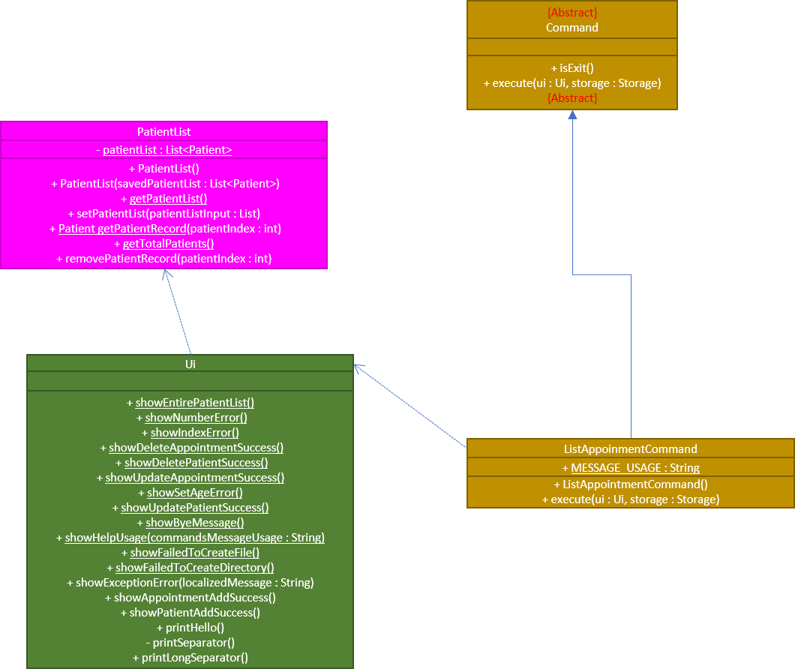

1. This class' object is first created by the ```Parser``` class, where it is then returned to the ```Main``` class to 
have its ```execute(Ui ui, Storage storage)``` function be called. 

2. When the ```Main``` class calls the 
```execute(Ui ui, Storage storage)``` function, ```ListAppointmentCommand``` will call upon the ```Ui```’s 
```showEntireAppointmentList()``` function to display the list of appointments.

Below shows the sequence diagram for ```ListAppointmentCommand``` class


#### 2.2.4.5 PatientIdManger Class

The ```PatientIdManager``` class manages the patient ids. It helps to generate unique patient ids for each new
 patient. The patient id chosen can either be a new number or a patient id number that is reused from a deleted
  patient. By reusing the patient id number from deleted patients, it allows us to have more patient id to use before
   the patient id number runs out.
   
Not only that, it ia also able to check if a patient id exist (as in is there any patients with a specific
 patient id). This is useful because it prevents the user from adding a new appointment for a non-existing patient.
 
 
 
Other than the getter and the setter methods, the most important methods in ```PatientIdManager``` are
 ```getNextPatientId()```, ```addBackPatientId()```, ```checkPatientIdUsed()``` and ```clearPatientId()```
 
 For ```checkPatientIdUsed()```, its purpose is to see if a patient Id is a currently used patient id (as in there is
 a patient currently that has this patient id). It achieves this using a hash table called ```patientIdMap```, where the
  key is the patient id
  number and its value is either null (this patient id has not been used) or 1 (this patient id has been used
  ). Whenever an appointment is added into HAMS, HAMS needs to ensure that the appointment's patient id corresponds
   to an actual patient in HAMS. This method helps by checking if the patient id supplied in the appointment entry
    belongs to an actual patient by checking the key-value pair in the ```patientIdMap``` and see if the patient id's
     value is 1 in said map
 
 To summarize ```checkPatientIdUsed()```
 
 1) Get the patient id to check.
 2) Let the patient id be the key. See the patient id's value in the ```patientIdMap``` hash table. If it is 1
 , return true (patient currently exist), else return false.
 
 ```checkPatientIdUsed()``` is used by the ```addAppointmentCommand``` class when adding an appointment to check if
  the patient id supplied belongs to a real patient currently in HAMS.
  
For ```addBackPatientId()```, its purpose is to save the patient id of deleted patients by storing them in the
 reusable patient id queue ```nextNumberQueueThing```. This will be useful for the ```getNextPatientId()``` method to get a patient id from a deleted patient. We also need to update the ```patientIdMap``` to reflect the changes made.
 
 To summarize ```addBackPatientId()```
 
 1) Get the deleted patient id.
 2) Check to see if the patient id is a valid id. A valid patient id is an id that does not exist in the reusable
  patient id queue and its value cannot be below 0 and (equal and above) ```nextTopNewNumber```.
 3) If the patient id is a valid id, then add it in the reusable patient id queue. Else, ignore it.
 4) Once it is deleted, update the ```patientIdMap``` map to reflect that the patient id now do not belong to any patient currently (set the corresponding value to null in the map).
 
 ```addBackPatientId()``` is used by the ```deletePatientClass``` when deleting a patient to store the deleted
  patient id number.
  
 
For ```getNextPatientId()```, its purpose is to supply a new patient id for a patient, be it a newly created id or an
 id from a deleted patient (reusing id). This is achieved with a combination of a queue (called the
  ```nextNumberQueueThing```) that serves to store
  the
  list of
  patient ids from deleted patients and an integer that serves to represent the next highest number to use if there
   are no patient ids that can be reused. 
   
To elaborate, whenever a patient is deleted, we want to store its patient id somewhere since it can be reused for a
 new patient (as it will still retain the uniqueness property of the patient id). Hence, a way to store those deleted
  patient's patient id is to store them in a queue such that we can call upon the queue for any reusable patient ids
  . We use a queue because inserting and popping elements in a queue is O(1) time, which makes it fast. If there are
   no elements in the queue (as in we have used up all or there isn't any reusable patient id present), then there
    exist another integer (called ```nextTopNewNumber```) that represents a new patient id that has not been used by
     any patient before. The value of ```nextTopNewNumber``` will be used for the patient id number if the queue is
      empty. After which, the ```nextTopNewNumber``` value get added by 1.

For example, when we just started HAMS and there has not been any deletion of patient thus far, the reusable
 patient id queue is empty. By default, ```nextTopNewNumber``` starts from 0. If we were to add 3 patients, then the
  first patient will get patient id 0 (which is the value of ```nextTopNewNumber```) currently (we use the value of
   ```nextTopNewNumber``` if there isn't any elements present in the resusable patient id queue), while the second
   patient gets the value of current ```nextTopNewNumber``` (which is 0) + 1, making patient number 2 has patient id
    1 and so on and so forth. The third patient will get patient id number 2. However, lets say we deleted patient
     number 2 and added a new patient (patient number 4, then patient number 2's patient id (patient id 1) will be
      stored in the queue. For the new patient added (patient number 4), instead of using the current
       ```nextTopNewNumber``` (which is 2), we will use
       the patient number present in the queue, which is 1. Thus, patient number 4 has the patient id of 1.

Finaly, once we chosen a number, we need to update ```patientIdMap``` map to reflect that there is now a new patient id that is used by a patient
       
One property of ```nextTopNewNumber``` is that all patient id numbers in the queue should be lesser than
 ```nextTopNewNumber``` (```nextTopNewNumber``` serves as the current upper-bound of the possible patient id). There
  will never exist a reusable patient id number (or any patient id number for that matter) that is bigger than
   ```nextTopNewNumber```.
       
To summarize ```getNextPatientId()```

1) Check if the reusable patient id queue is empty
2) If it is not empty, we take a patient id from the queue.
3) On the other hand, if it is empty, we use the value of ```nextTopNewNumber``` for the patient id. We then increase
 the value of ```nextTopNewNumber``` by 1.
4) Once we decided on which patient id to use, update the ```patientIdMap``` map to reflect that the patient id now belongs to a patient (set the corresponding value in the map to 1).

```getNextPatientId()``` is used by the ```addPatientCommandClass``` when adding a patient to get a unique patient id
 for the new patient.

Lastly, for ```clearPatientId()```, it resets the value of  ```nextTopNewNumber```, clears the reusable patient id queue
 ```nextNumberQueueThing``` and finally clears the hash table ```patientIdMap```. This method serves to reset the
  ```patientIdManager``` back to its default state.
  
```clearPatientId()``` is used by both ```ClearPatientCommand``` and ```ClearAllCommand``` class to reset the
 ```patientIdManager``` state since both commands clears all the current patients in HAMS, which meant that all the
  patient id in HAMS must be reset as there are no patients left.

##### 2.2.4.6 Design considerations

For the 5 classes listed, there were some other design considerations that was discussed for these 5 classes. Here
, we will discuss the other choices and the pros and cons for them.

###### 2.2.4.6.1 Aspect: Facade classes
+ Alternative 1 (current choice): Making all 4 classes facade classes
   
   * Pros: 
        - Stronger Single Responsibility Principle (SRP) and Separation of Concerns Principle (SoC)
   
   * Cons:
        - Higher dependencies and couplings on the other classes to work.

+ Alternative 2: Put the actual adding logic into the classes

    * Pros:
        - Weaker dependency and couplings on the other classes
    
    * Cons:
        - Lower SRP and (SoC)

###### 2.2.4.6.2 Aspect: Autosaving or no

+ Alternative 1 (current choice): Allow for autosaving after each command execution
    * Pros: 
        - Allow for recovery when crashing
        - Negligible performance effect on higher end computer system
       
    * Cons:
        - Since saving is writing to disk, it may be an expensive process for weaker computer system. Weaker computer system may be slowed down by the constant saving

+ Alternative 2: Save only when exiting HAMS
    * Pros: 
        - Faster, especially for weaker computer systems
       
    * Cons:
        - No recovery (or rather, no recovery for recent information) when HAMS crashes 

###### 2.2.4.6.3 Aspect: Generation of Patient Id

+ Alternative 1 (current choice): Allow the reuse of the patient Id from deleted patients
    * Pros: 
        - Allow for reuse, which prevents the patient Id number from running out.
       
    * Cons:
        - Slightly more complicated implementation. Also it means that there is more information that is required to be saved (such as the list of patient Id to be reused) when HAMS shuts down.

+ Alternative 2: Always pick a new number (don't reuse deleted patient Id number)
    * Pros: 
        - Easier to implement and keep track of. Also, it does not need to save much more information about the patient Id numbers (just need to save the last number assigned).
       
    * Cons:
        - Much more likely to run out of patient id numbers, especially if patients are getting added and deleted from HAMS continuously and consecutively.
        
###### 2.2.4.6.4 Aspect: Deciding how to reuse Patient Id

+ Alternative 1 (current choice): For reusable patient id, just choose the patient id number that have not been
 assigned the longest
    * Pros:
        - Easy to implement (just use a Queue) and ensures an O(1) time.
    * Cons:
        - Patient id number is not really in sequence (it is possible for a bigger patient id number might be assigned
         first before a smaller patient id number). As a result, the new patient id number is not that predictable
          (unless you are keeping track of which patient id numbers are deleted first).

+ Alternative 2: Sort the reusable patient id first such that the smallest patient id is always reused first 
    * Pros: 
        - Patient id number is in sequence (always assign the smaller patient id number first), which seems to make
         it easier to predict the next patient's patient id number.
    * Cons:
        - Sorting is O(n log n) time, hence making it slightly slower than current implementation.
        
### [Back to top &#x2191;](#table-of-content)

#### 2.2.4.7 EditAppointmentClass

To edit an appointment, the ```EditAppointmentCommand``` class is used. For this ```EditAppointmentCommand``` class, it 
serves as a facade class for the ```Main```, ```Appointment```, ```AppointmentList```, ```Ui``` and the ```Storage``` class to 
interact with one another. 

1. The ```EditAppointmentCommand``` class is processed by ```Parser```

2. When 
the ```Main``` calls ```execute(Ui ui, Storage storage)```, the ```EditAppointmentCommand``` class would call upon the 
```Appointment``` class to make an ```Appointment``` Object. 

3. After which, the ```EditAppoinmentCommand``` object will  call upon the ```AppointmentList``` object to get the record 
of the record of the appointment based on the index with ```getAppointmentRecord``` .

4. After that, ```EditAppoinmentCommand``` will  call the ```setAppointmentInfo``` method from ```Patient`` to update the
appointment.

5. The ```AppointmentList``` will be updated with the newly updated appointment.

6. Finally, it will call upon the ```Storage``` class’s ```saveAppoinmentList()``` function to save the updated appointment list. 

7. Upon successfully editing the 
```Appointment``` object into the appointment list, it will call upon the ```Ui``` class’ 
```showUpdateAppointmentSuccess()``` function to display the success of adding the ```appointment``` in the appointment 
list.

Below shows the sequence diagram for ```EditAppointmentCommand``` class.

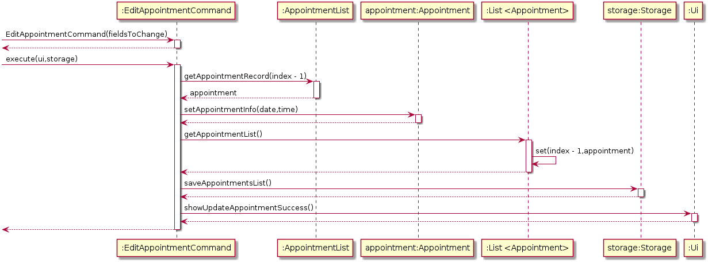

#### 2.2.4.8 EditPatientCommand CLass

To edit an appointment, the ```EditPatientCommand``` class is used. For this ```EditPatientCommand``` class, it 
serves as a facade class for the ```Main```, ```Patient```, ```PatientList```, ```Ui``` and the ```Storage``` class to 
interact with one another. 

1. The ```EditPatientCommand``` class is processed by ```Parser```

2. When 
the ```Main``` calls ```execute(Ui ui, Storage storage)```, the ```EditPatientCommand``` class would call upon the 
```Patient``` class to make a ```Patient``` Object. 

3. After which, the ```EditPatientCommand``` object will  call upon the ```PatientList``` object to get the record 
of the record of the patient based on the index with ```getPatientRecord``` .

4. After that, ```EditPatientCommand``` will  call the ```setPatientInfo``` method from ```Patient`` to update the
patient.

5. The ```AppointmentList``` will be updated with the newly updated patient.

6. Finally, it will call upon the ```Storage``` class’s ```savePatienttList()``` function to save the updated patient list. 

7. Upon successfully editing the 
```Patient``` object into the appointment list, it will call upon the ```Ui``` class’ 
```showUpdatePatientSuccess()``` function to display the success of adding the ```patient``` in the appointment 
list.

Below shows the sequence diagram for ```EditPatientCommand``` class.

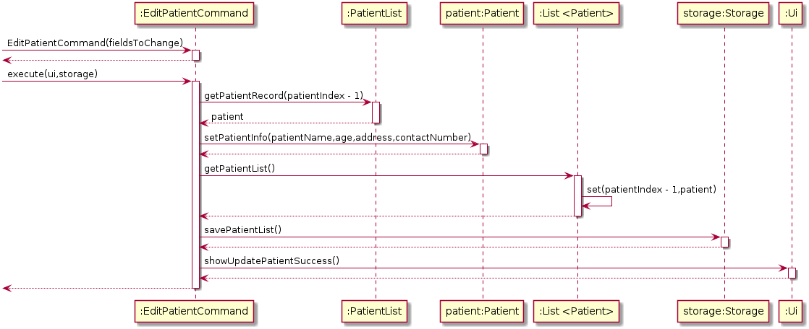

#### 2.2.4.9 DeleteAppointmentCommand Class

To delete an appointment, the ```DeleteAppointmentCommand``` class is used. For this ```DeleteAppointmentCommand``` class, it 
serves as a facade class for the ```Main```, ```Appointment```, ```AppointmentList```, ```Ui``` and the ```Storage``` class to 
interact with one another. 

1. The ```DeleteAppointmentCommand``` class is processed by ```Parser```

2. When the ```Main``` calls ```execute(Ui ui, Storage storage)```, the ```DeleteAppointmentCommand``` class would call upon the 
```Appointment``` class to make an ```Appointment``` Object. 

3. After which, the ```DeleteAppoinmentCommand``` object will  call upon the ```AppointmentList``` object to get the appointment
list with ```getAppointmentList()``` and remove the appointment record with given index from ```getAppointmentRecord()```

4. Finally, it will call upon the ```Storage``` class’s ```saveAppoinmentList()``` function to save the updated appointment list. 

5. Upon successfully deleting the 
```Appointment``` object into the appointment list, it will call upon the ```Ui``` class’ 
```showDeleteAppointmentSuccess()``` function to display the success of deleting the ```appointment```from the appointment 
list.

Below shows the sequence diagram for ```DeleteAppointmentCommand``` class.

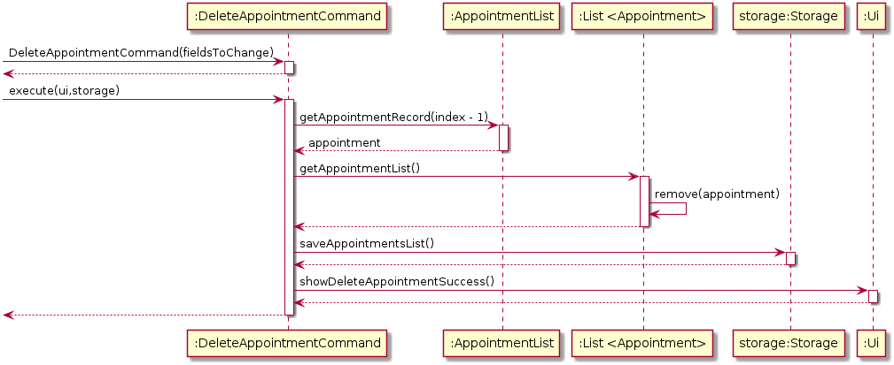

#### 2.2.4.10 DeletePatientCommand Class

To delete an appointment, the ```DeletePatientCommand``` class is used. For this ```DeletePatientCommand``` class, it 
serves as a facade class for the ```Main```, ```Appointment```, ```AppointmentList```, ```Ui``` and the ```Storage``` class to 
interact with one another. 

1. The ```DeletePatientCommand``` class is processed by ```Parser```

2. When the ```Main``` calls ```execute(Ui ui, Storage storage)```, the ```DeletePatientCommand``` class would call upon the 
```Patient``` class to make a ```Patient``` Object. 

3. After which, the ```DeletePatientCommand``` object will  call upon the ```PatientList``` object to get the patient
list with ```getPatientList()``` and remove the patient record with given index from ```getPatientRecord()```

4. Then it will go through all the items in ```AppointmentList``` with the patientId of the patient that has been deleted

4. Finally, it will call upon the ```Storage``` class’s ```savePatientList()``` function to save the updated patient list. 

5. Upon successfully deleting the ```Patient``` object from the patient list, it will call upon the ```Ui``` class’ 
```showDeletePatientSuccess()``` function to display the success of deleting the ```patient```from the patient 
list.

Below shows the sequence diagram for ```DeletePatientCommand``` class.

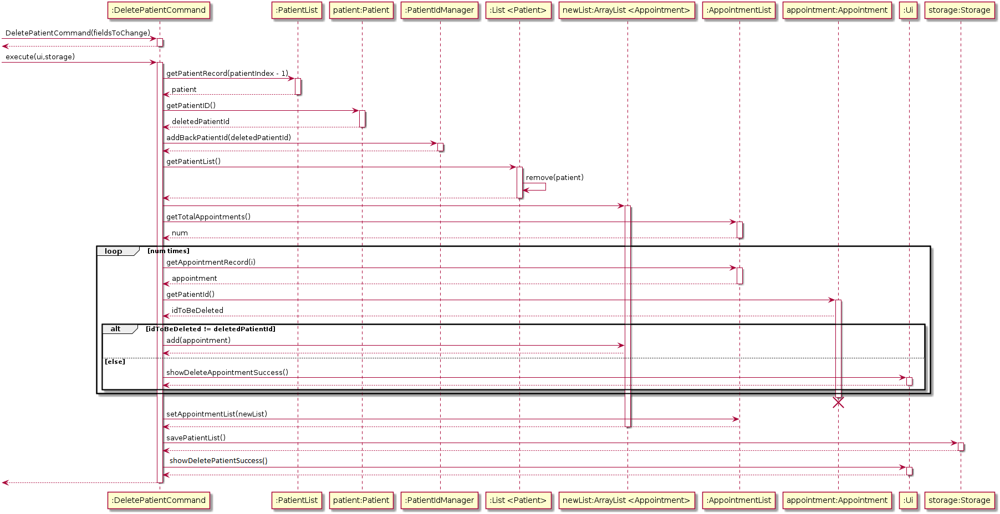

#### 2.2.4.11 ClearAllCommand Class

To clear both appointment list and patient list, the ```ClearAllCommand``` class is used. For this ```ClearAllCommand``` class, it 
serves as a facade class for the ```Main```, ```PatientList```, ```AppointmentList```, ```Ui``` and the ```Storage``` class to 
interact with one another. 

1. The ```ClearAllCommand``` class is processed by ```Parser```

2. When the ```Main``` calls ```execute(Ui ui, Storage storage)```, the ```ClearAllCommand``` class would call upon the 
```PatientList``` and ```AppointmentList``` to clear all the items in both lists

3. It will call upon the ```Storage``` class’s ```savePatientList()``` and ```saveAppointmentList()```function 
to save the updated patient list and appointment list.

4. Upon successfully clearing all the lists, it will call upon the ```Ui``` class’ ```showAllItemsDeleted()``` function 
to display the success of clearing all the items.

Below shows the sequence diagram for ```ClearAllCommand``` class.

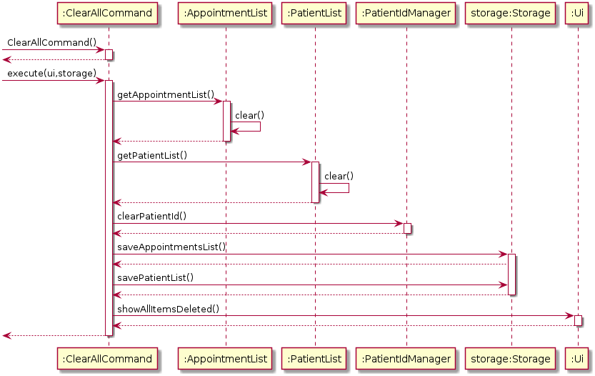

#### 2.2.4.12 ClearAppointmentCommand Class

To clear appointment list, the ```ClearAppointmentCommand``` class is used. For this ```ClearAppointmentCommand``` class, it 
serves as a facade class for the ```Main```, ```AppointmentList```, ```Ui``` and the ```Storage``` class to 
interact with one another. 

1. The ```ClearAppointmentCommand``` class is processed by ```Parser```

2. When the ```Main``` calls ```execute(Ui ui, Storage storage)```, the ```ClearAppointmentCommand``` class would call upon the 
```AppointmentList``` to clear the items in appointment list.

3. It will call upon the ```Storage``` class’s ```saveAppointmentList()```function to save the updated appointment list.

4. Upon successfully clearing the list, it will call upon the ```Ui``` class’ ```showAppointmentsDeleted()``` function 
to display the success of clearing all the items in appointment list.

Below shows the sequence diagram for ```ClearAppointmentCommand``` class.

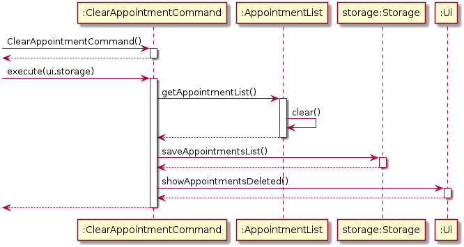

#### 2.2.4.13 ClearPatientCommand Class

To clear patient list, the ```ClearPatientCommand``` class is used. For this ```ClearPatientCommand``` class, it 
serves as a facade class for the ```Main```, ```PatientList```, ```Ui``` and the ```Storage``` class to 
interact with one another. 

1. The ```ClearPatientCommand``` class is processed by ```Parser```

2. When the ```Main``` calls ```execute(Ui ui, Storage storage)```, the ```ClearPatientCommand``` class would call upon the 
```PatientList``` to clear the items in patient list.

3. It will call upon the ```Storage``` class’s ```savePatientList()```function to save the updated patient list.

4. Upon successfully clearing the list, it will call upon the ```Ui``` class’ ```showPatientsDeleted()``` function 
to display the success of clearing all the items in patient list.

Below shows the sequence diagram for ```ClearPatientCommand``` class.

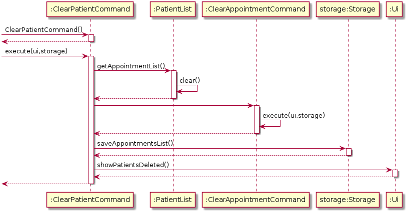

#### 2.2.4.14 HelpCommand

To see the help usage for the commands in HAMS, the ```HelpCommand``` class is used. For this ```HelpCommand``` class, it 
serves as a facade class for the ```Main```, ```Ui``` class to interact. The purpose of the class is to print out the usage
for all the commands in HAMS through ```showHelpUsage()``` in ```Ui```.

Below shows the sequence diagram for ```HelpCommand``` class.

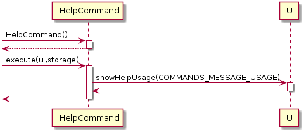
 
#### 2.2.4.15 ExitCommand
 
To print the bye message for HAMS, the ```HelpCommand``` class is used. For this ```ClearPatientCommand``` class, it 
serves as a facade class for the ```Main```, ```Ui``` class to interact.

1. The ```Main``` class will check whether ```isExit()``` is set to be true or not.

2. ```Ui``` class' ```showByeMessage()``` method is used to print the bye message for users.
 
Below shows the sequence diagram for ```ExitCommand``` class.

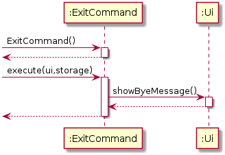

### [Back to top &#x2191;](#table-of-content)


#### 2.2.5 Parser module
This section describes the implementation of Parser class, as well as the design considerations and rational behind the 
current implementation.

The main purpose of the Parser class is as below.
1.  To interpret user inputs so that the correct command can be executed 
2.  Functions as the first line to sanitize user input

As such, the Parser class only has one publicly callable method and that returns the command object for execution. 
To assist the public method, Parser class has multiple private helper methods, as well as access to the Exception handler
to ensure that the user input is formatted correctly. This way, purpose 1 and 2 is satisfied. 

##### 2.2.5.1 Object creation and steps in input interpretation
1.  The `Parser` object is first created in `Duke` class and subsequently used until program termination.
2.  User input is received and handed over to `Parser` object for interpretation.
3. In the `Parser` object, the type of command is first determined via helper method `getCommand(userInput)`.
    + Example: `addp \age 23 \name Justin`, the `addp` command will be determined.
4. The remaining fields will be recorded in a hashMap through either `fillPatientFields(userInput)` or `fillAppointmentFields(userInput)`
depending on the command type in Step 3.
    + The type of category of the command can be determined based on the last alphabet of the first word. 
    + The command `addp` has the last alphabet is `p`, `fillPatientFields()` will be called. 
    Likewise, if it ise `adda`, it will be `fillAppointmentFields()`.
    + Example: `addp \name Sam \age 18`, the method `fillPatientFields(userInput)` will be called. The hashMap will contain
    age -> 23, name -> Sam. 
5. At the end of the execution, a reference to the command object will be returned. 

>

>

Sequence Diagram when `parseCommand(userInput)` is initially called


Sequence Diagram for `addp`


Sequence Diagram for `editp`


Sequence Diagram for `deletep`


Sequence Diagram for `adda`


Sequence Diagram for `edita`


Sequence Diagram for `deletea`


Sequence Diagram when it is an unknown command


Sequence Diagram for the creation of the command Object


Sequence Diagram for error checking when `DukeExpcetion` is called


Sequence Diagram for calling an enum


Sequence Diagram for error checking when `DukeExpcetion` is called


>

|Enum|PatientFieldKeys|AppointmentFieldKeys
|--------|-------|------|
|.|INDEX|INDEX|
|.|NAME|DATE|
|.|AGE|TIME|
|.|ADDRESS|.|
|.|CONTACT_NUMBER|.|

>

|DukeExceptions|checkFieldEmpty|checkIndexValidity
|--------|-------|------|
|.|Based on the above enum table, checks that at least 1 field  is provided. <br><br>Throws NoFieldCommandException if all fields are empty|Check that the index provided is valid. <br><br> If it is less than 0 or not an integer, throw InvalidIndex and IndexNotInteger respectively.|


##### 2.2.5.2 Design considerations
###### Aspect: Symbol for delimiter
+   Alternative 1 (current choice): Backslash `\` is used. 
    *   Pros: 
    
        -   Backslash is the least used symbol in the english language.
        
    *   Cons: 
    
        - More caution must be exercised to used backslash in computer language as REGEX uses it as a delimiter by
          default.
          
        - Might break the speed at which user type since backslash is located where it would be hard to reach with
          regular typing. 

+   Alternative 2: Slash is `/` used.
    * Pros:
    
        - easier to access when typing
        
    * Cons:
    
        - some people may have a slash in their legal name - `Suresh S/O Ravindran`
     
###### Aspect: Symbol for delimiter
+   Alternative 1 (current choice): Each command will call its own method to parse field. 
    *   Pros: 
    
        -   Decouples commands from method, making the code more modular.
        -   Increases testability, bugs found can be isolated to the individual command and method respectively
        -   Changes to one method will only affect the command calling it and vice-versa.
        
    *   Cons: 
    
        -   Code duplication will increase
 
+   Alternative 2: Every command calls a common method to parse the remaining fields. 
    * Pros:
    
        -   Less code duplication
        
        -   Easier to understand code. 
        
    * Cons:
    
        - Leads to tighter coupling
        
        -   All command depends on this common method to parse fields, if the method changes, it may return the wrong
        result for some commands. 

### [Back to top &#x2191;](#table-of-content)

## 3. User Stories

|Version| As a ... | I want to ... | So that I can ...|
|--------|----------|---------------|------------------|
|v1.0|new admin assistant|see usage instructions|refer to them when I forget how to use the application|
|v1.0|admin assistant|add upcoming appointments|set the patient's future appointments|
|v1.0|admin assistant|obtain upcoming appointments|remind patients of their appointment|
|v1.0|admin assistant|reschedule appointments|help the patient change his appointment dates|
|v1.0|admin assistant|add and delete patient's address|update the information in the system|
|v1.0|admin assistant|add and delete telephone number|contact the patient directly|
|v1.0|admin assistant|have an interface|easily update the patient's personal information|
|v1.0|admin assistant|register new patient's medical information|so that it can be stored and accessed whenever needed|
|v1.0|admin assistant|save my data on shutdown|continue my work the next day|
|v2.0|busy admin assistant|immediately know if the patient is scheduled for today|so I can process them better|
|v2.0|admin assistant|be able to find a specific patient|check their appointment details|
|v2.0|admin assistant|clear my lists|keep my list organized when the appointment is over|

### [Back to top &#x2191;](#table-of-content)

## 4. Non-Functional Requirements
* HAMS should be usable with minimal training, all commands should be self-explanatory and viewing the in-application
help menu should be sufficient for basic usage. 

* HAMS should be resistant to software crashes and if a crash does happens, the latest patient and 
appointment list should be saved. In addition, user should be able to manually save their work. 

* Each function of HAMS can be executed in a single line.

* HAMS should be fast and responsive

### [Back to top &#x2191;](#table-of-content)

## 5. Instructions for Manual Testing

### 5.1 Startup, shutdown and restart with saved list.
1. Initial launch
    1. Download the latest release from [here](https://github.com/AY1920S2-CS2113T-T13-3/tp/releases)
    2. Move the .jar to an empty folder
    3. Open Command Prompt
    4. In Command Prompt, change your current working directory to the folder containing the .jar using $ `cd <Path of folder containing .jar>`
    5. Run the .jar using $ `java -jar hams-2.0.jar`
    
    Expected: Shows a welcome screen for HAMS.

2. Shutdown
    1. Run the .jar file
    2. Test case: `exit`
    
    Expected: Bye message is printed and program closes.
 
3. Restart with saved list
    1. Run the .jar file
    2. Add some patients and appointments.
    3. Restart the program
    4. Test case: `listp`
    
    Expected: Previous saved list should be shown.
    
### 5.2 Adding a patient
1. Successfully adding a patient (All fields)
    1. Run the .jar file.
    2. Test case: `addp \name Justin \age 23 \address Pasir Ris \phone 91234567`
    
    Expected: Success message is printed. To double check, type `listp` and ensure that the test case
    is inside.
    
2. Successfully adding a patient (at least 1 field)
    1. Run the .jar file.
    2. Test case: `addp \name Sam`
    
    Expected: Success message is printed. HAMS accept `addp` as long as 1 field is present. To double check, type `listp` and ensure that the test case
    is inside.

3. Unsuccessful add a patient  (no fields provided)
    1. Run the .jar file.
    2. Test case: `addp`
    
    Expected: Error message is printed. To double check, type `listp` and ensure that the test case
    is **not** inside.

### 5.3 Delete a patient

1. Deleting a patient 
    1. Prerequisites: list all patients using `listp`. Multiple patients in list.
    2. Test case: `deletep \index 1`
    
    Expected: First patient in the list is deleted. 
    

### [Back to top &#x2191;](#table-of-content)
