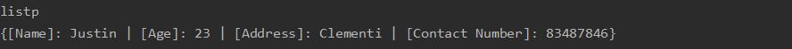

# User Guide For Hospital Management System v1.0

# Table of content
<!-- TOC -->

* [1. Introduction](#1-introduction)
    + [1.1. Starting HAMS](#11-starting-hams)
* [2. Features](#2-features)
* [3. Command Format](#3-command-format)
* [4. Command Usage](#4-command-usage)
    + [4.1. Patient Commands](#41-patient-commands)
        + [4.1.1 Add new patient record](#411-add-a-new-patient-record)
        + [4.1.2 List all existing patient records](#412-list-all-existing-patients)
        + [4.1.3 Delete existing patient record](#413-delete-an-existing-patient)
        + [4.1.4 Edit existing patient record](#414-edit-an-existing-patient)
    + [4.2. Appointment Commands](#42-appointment-commands)
        + [4.2.1 Add new appointment record](#421-add-a-new-appointment-record)
        + [4.2.2 List all existing appointment records](#422-list-all-existing-appointments)
        + [4.2.3 Delete existing appointment record](#423-delete-an-existing-appointment)
        + [4.2.4 Edit existing appointment record](#424-edit-an-existing-appointment)
    + [4.3. Viewing help](#43-view-help)
    + [4.4. Exiting the program](#44-exit-hams-program)
* [5. Command Summary](#5-command-summary)  
* [6. FAQ](#6-faq)  

<!-- /TOC -->

## 1. Introduction

HAMS is a CLI-based medical facility administration system that assists in the maintenance of various medical records.  
Its functionality has some resemblance to the Duke ChatBot, a CS2113 individual project.

HAMS is designed for administrative assistants in medical facilities, like hospitals or polyclinics, that *prefer using
CLI to keep track of various medical records* and *can type fast*.
    
### 1.1 Starting HAMS
1. Ensure you have JDK 11 installed on your computer. You can download the installer for your OS from [here](https://www.oracle.com/java/technologies/javase-jdk11-downloads.html).
2. Download the latest .jar file release for HAMS from [GitHub](https://github.com/AY1920S2-CS2113T-T13-3/tp/releases).
3. Move the .jar to an empty folder.
4. Open Command Prompt.
5. In Command Prompt, change your current working directory to the folder containing the .jar using `cd <Path of folder containing .jar>`
6. Run the .jar using `$ java -jar hams-1.0.jar`
 
&nbsp;

## 2. Features

#### Keep track of different record types
HAMS provides you with an easy-to-use system that helps manage and keep track of two types of medical records: *Patients* and *Appointments*.

#### View all your tasks
The `lista` or `listp` command that HAMS provides can display all the Appointment or Patient records within the system in a readable format.

#### Auto-save and store these records
HAMS has an auto-save feature which stores Patient and Appointments every time you add or modify them. 
With this feature, your tasks will be saved every time you leave the application and can be easily retrieved when you reopen the application subsequently.

&nbsp;

## 3. Command Format

Words enclosed within angle brackets `[]` are the parameters to be supplied by the user. Other keywords stated are compulsory and they should be included.

For example, in `adda \date [date] \time [time]`, `adda` is the command keyword that adds an Appointment record. 

`\date` and `\time` are compulsory labels to denoting what field the subsequent information belongs to.
`[date]` is the date of the appointment to be supplied by you. `[time]` represents the time of the appointment to be supplied by you.

A valid input would be `adda \date Mar 17 \time 2pm`.

&nbsp;

## 4. Command Usage

### 4.1 `Patient` Commands

#### 4.1.1 Add a new Patient record

The program allows you to add a new Patient record to the current list of Patient records. The command contains:
1. the `addp` keyword
2. `\name` followed by the name of the patient 
3. `\age` followed by the age of the patient
4. `\address` followed by the address of the patient
5. `\phone` followed by the contact number of the patient
(All these fields will be developed so that later on they have certain limit and validation of the text or number inputted)

Format: `addp \name [name] \age [age] \address [address] \phone [phone]`

#### Example of usage: 
- `addp \name Justin \address Pasir Ris \age 20 \phone 98889888`

##### Expected outcome:

#### Example of usage: 
- `addp \age 20 \phone 98889888 \name Justin \address Pasir Ris`

##### Expected outcome:

#### Example of wrong usage 
- `addp` 

##### Expected error outcome:

#### 4.1.2 List all existing Patients

The command simply contains the 'listp' keyword.

Format: `listp`
#### Example of usage: 
`listp`

##### Expected outcome 

#### 4.1.3 Delete an existing Patient

The program allows you to delete an existing Patient record by its index in the list. The command contains:
1. the `deletep` keyword
2. `\index` followed by the index number of the patient to be deleted 

Format: `deletep \index [patient number in list]`

#### Example of usage: 
`deletep \index 2`

##### Expected outcome:

#### Example of wrong usage:
- `deletep \index a`

##### Expected error outcome:

#### 4.1.4 Edit an existing Patient

The program allows you to make changes to an existing Patient record by its index in the list. The command contains:
1. the `editp` keyword
2. `\index` followed by the index number of the Patient record in the list
3. `\name` followed by the name of the patient
4. `\age` followed by the age of the patient
4. `\address` followed by the address of the patient
4. `\phone` the contact number of the patient
Note that users do not need to include any single field that needs to be modified in the command.
Illustration will be later shown in the command's format and usage.

Format: `editp \index [patientNumber] \name [name] \age [age] \address [address] \phone [phone]`

#### Example of usage: 
`editp \index 1  \name Justin \age 23 \address Clementi \phone 83487846`

##### Expected outcome:

###### Before:

###### After:

#### Example of usage: 
`editp \age 99 \address Bedok \phone 89993999 \name Justin \index 1`

##### Expected outcome:

###### Before:

###### After:

#### Example of wrong usage: 
`editp \index a \address Paris Ris \phone 93489678`

##### Expected outcome:

### 4.2 `Appointment` Commands

#### 4.2.1 Add a new Appointment record

The program allows you to add a new Appointment record to the current list of Appointment records. The command contains:
1. the `adda` keyword
2. `\date` followed by the date of the appointment
3. `\time` followed by the time of the appointment
(Both date and time are currently in string so they will be further developed later)

Format: `adda \date [date] \time [time]`

#### Example of usage: 
- `adda \date 14-03-2020 \time 10am`

##### Expected outcome:
`//Insert UI here`

#### Example of wrong usage (missing description): 
`//Insert UI here`

##### Expected error outcome:
`//Insert UI here`

#### 4.2.2 List all existing Appointments

The command simply contains the 'lista' keyword.

Format: `lista`

#### Example of usage: 
`lista`

##### Expected outcome:

#### Example of wrong usage : 

##### Expected error outcome:

#### 4.2.3 Delete an existing Appointment

The program allows you to delete an existing Appointment record by its index in the list. The command contains:
1. the `deletea` keyword
2. `\index` followed by the index number of the Appointment to be deleted 

Format: `deletea \index [appointment number in list]`

#### Example of usage: 
- `deletea \index 3`

##### Expected outcome:

#### Example of wrong usage : 

##### Expected error outcome:

#### 4.2.4 Edit an existing Appointment

The program allows you to make changes to an existing Appointment record by its index in the list. The command contains:
1. the `edita` keyword
2. `\index` followed by the index number of the Appointment in the list.
3. `\date` followed by the date of the appointment 
4. `\time` followed by the time of the appointment
Note that users do not need to include any single field that needs to be modified in the command.
Illustration will be later shown in the command's format and usage

Format: `edita \index [appointmentNumber] \date [date] \time [time]`

#### Example of usage: 
`edita \index 3 \date 20-05-2021 \time 11pm`

##### Expected outcome:

#### Example of usage: 
`edita \index 3 \time 11pm \date 20-05-2021`

##### Expected outcome:

#### Example of usage: 
`edita \index 5 \time 11:30am`

##### Expected outcome:

### 4.3 View help

The 'help' keyword provides you with a list of valid commands, their functions and their proper usages.

Format: `help`

#### Example of usage: 
`help`

##### Expected outcome 

### 4.4 Exit HAMS program

This command exits the HAMS program and saves the current Patient/Appointment data into separate local save files (in `/saves/appointments.txt` or `/saves/patients.txt`). These files will be loaded to the program when it is run again subsequently.

Format: `exit`
#### Example of usage: 
`exit`

##### Expected outcome: 

## 5. Command Summary

* `adda \date [date] \time [time]` Adds date and time of an appointment
* `addp \name [name] \age [age] \address [address] \phone [phone]` Adds name, age, address, and contact number of patient
* `lista` List all the appointments from the appointment's list
* `listp` List all the patients from the patient's list
* `deletea \index [appointment number in list]` Delete an appointment by the list's appointment number
* `deletep \index [patient number in list]` Delete a patient by the list's patient number
* `edita \index [appointmentNumber] \date [date] \time [time]` Edit date or time of an appointment by the list's appointment number
* `editp \index [patientNumber] \name [name] \age [age] \address [address] \phone [phone]` Edit date or time of an appointment by the list's appointment number
* `help` Give you a manual on a list of valid commands and their usage
* `exit` Exit the program and save the task into an offline data file (in `/saves/appointments.txt` or `/saves/patients.txt`)

## 6. FAQ
**Q**: Would my details be captured if I randomnize the input order of the keywords?

`addp \phone 12345678 \address NUS \age 22 \name John Doe`
`addp \name John Doe \address NUS \ age 22 \ phone 12345678`

**A**: Yes. The system is keyword-sensitive. Regardless of the order given, it stores the information within each command used respectively. Both examples provided above would result in the same information stored. 

**Q**: Why does my patient list display a "-1" in the age field?
`{[Name]: Tommy | [Age]: -1 | [Address]:  | [Contact Number]: 92331234}`

**A**: The age field provided by the user is empty. 

