# User Guide For Hospital Management System v2.0

# Table of content
<!-- TOC -->

* [1. Introduction](#1-introduction)
    + [1.1. Starting HAMS](#11-starting-hams)
* [2. Features](#2-features)
* [3. Command Format](#3-command-format)
* [4. Command Usage](#4-command-usage)
    + [4.1. Patient Commands](#41-patient-commands)
        + [4.1.1 Add new patient record](#411-add-a-new-patient-record)
        + [4.1.2 List all existing patient records](#412-list-all-existing-patients)
        + [4.1.3 Delete existing patient record](#413-delete-an-existing-patient)
        + [4.1.4 Edit existing patient record](#414-edit-an-existing-patient)
        + [4.1.5 Find existing patient record](#415-find-an-existing-patient)
        + [4.1.6 Clear all patient records](#416-clear-patient-records)
    + [4.2. Appointment Commands](#42-appointment-commands)
        + [4.2.1 Add new appointment record](#421-add-a-new-appointment-record)
        + [4.2.2 List all existing appointment records](#422-list-all-existing-appointments)
        + [4.2.3 Delete existing appointment record](#423-delete-an-existing-appointment)
        + [4.2.4 Edit existing appointment record](#424-edit-an-existing-appointment)
        + [4.2.5 Find existing appointment record](#425-find-an-existing-appointment)
        + [4.2.6 Clear all appointment records](#426-clear-appointment-records)
    + [4.3 Clear all records](#43-clear-all-records)
    + [4.4. Viewing help](#44-view-help)
    + [4.5. Exiting the program](#45-exit-hams-program)
* [5. Command Summary](#5-command-summary)  
* [6. FAQ](#6-faq)  

<!-- /TOC -->

## 1. Introduction

This document serves as a user guide for HAMS. It teaches the user how to install HAMS, describes the features of HAMS, 
explains how HAMS can be used and finally answer some frequently asked questions about HAMS.
 
HAMS is a CLI-based medical facility administration system that assists in the maintenance of various medical records. 

HAMS is designed for administrative assistants in medical facilities, like hospitals or polyclinics, that *prefer using
CLI to keep track of various medical records* and *can type fast*.

***
    
### 1.1 Starting HAMS
1. Ensure you have JDK 11 installed on your computer. You can download the installer for your OS from [here](https://www.oracle.com/java/technologies/javase-jdk11-downloads.html).
2. Download the latest .jar file release for HAMS from [GitHub](https://github.com/AY1920S2-CS2113T-T13-3/tp/releases).
3. Move the .jar to an empty folder.
4. Open Command Prompt.
5. In Command Prompt, change your current working directory to the folder containing the .jar using $ `cd <Path of folder containing .jar>`
6. Run the .jar using $ `java -jar hams-2.0.jar`

### [Back to top &#x2191;](#table-of-content)
 
&nbsp;

***

## 2. Features

#### Keep track of different record types
HAMS provides you with an easy-to-use system that helps manage and keep track of two types of medical records: *Patients* and *Appointments*.

#### View all your tasks
The `lista` or `listp` command that HAMS provides can display all the Appointment or Patient records within the system in a readable format.

#### Auto-save and store these records
HAMS has an auto-save feature which stores Patient and Appointments every time you add or modify them. 
With this feature, your tasks will be saved every time you leave the application and can be easily retrieved when you reopen the application subsequently.

### [Back to top &#x2191;](#table-of-content)

&nbsp;

***

## 3. Command Format

Words enclosed within angle brackets `[]` are the parameters to be supplied by the user. Other keywords stated are compulsory and they should be included.

For example, in `adda \date [date] \time [time] \pid [patient id]`, `adda` is the command keyword that adds an
 Appointment record. 

`\date` and `\time` are compulsory labels to denoting what field the subsequent information belongs to.
`[date]` is the date of the appointment to be supplied by you. `[time]` represents the time of the appointment to be supplied by you.

A valid input would be `adda \date 22/05/2020 \time 1200 \pid 1`.

> 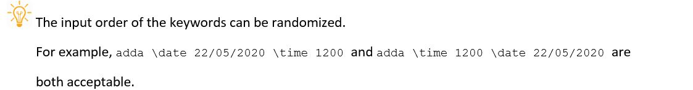

> 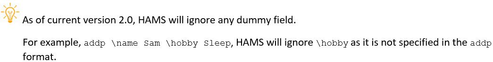

> 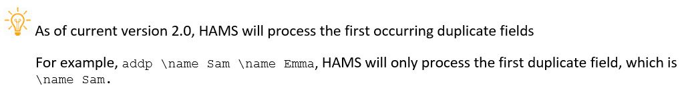

### [Back to top &#x2191;](#table-of-content)

&nbsp;

***

## 4. Command Usage

### 4.1 Patient Commands

#### 4.1.1 Add a new Patient record

The program allows you to add a new Patient record to the current list of Patient records. 

Format: `addp \name [name] \age [age] \address [address] \phone [phone]`

* `addp` keyword
* `\name` followed by the name of the patient 
* `\age` followed by the age of the patient
* `\address` followed by the address of the patient
* `\phone` followed by the contact number of the patient

> 

> 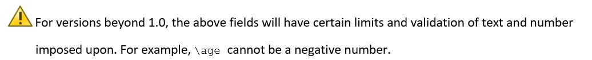

##### Examples of Usage

OK? |   Usage    |   Outcome 
------------- | ------------- | ---------------
OK | `addp \name Justin \address Pasir Ris \age 20 \phone 98889888` | 
OK | `addp \age 20 \phone 98889888 \name Justin \address Pasir Ris` | 
NOT OK | `addp` | 

#### 4.1.2 List all existing Patients

The command simply contains the 'listp' keyword.

Format: `listp`
#### Example of usage: 
`listp`

##### Expected outcome 
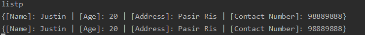 

#### 4.1.3 Delete an existing Patient

The program allows you to delete an existing Patient record by its index in the list. The command contains:
* `deletep` keyword
* `\index` followed by the index number of the patient to be deleted 

Format: `deletep \index [patient number in list]`

OK? |   Usage    |   Outcome 
------------- | ------------- | ---------------
OK | `deletep \index 2` | 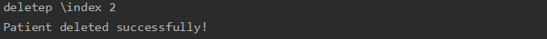
NOT OK | `deletep \index a` | 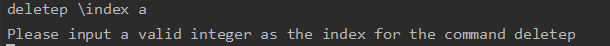

#### 4.1.4 Edit an existing Patient

The program allows you to make changes to an existing Patient record by its index in the list. 

Format: `editp \index [patientNumber] \name [name] \age [age] \address [address] \phone [phone]`

* `editp` keyword
* `\index` followed by the index number of the Patient record in the list
* `\name` followed by the name of the patient
* `\age` followed by the age of the patient
* `\address` followed by the address of the patient
* `\phone` the contact number of the patient

> 

#### Example of usage: 
`editp \index 1  \name Justin \age 23 \address Clementi \phone 83487846`

##### Expected outcome:
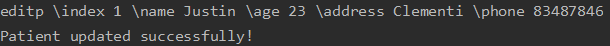
###### Before:
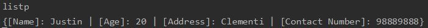
###### After:
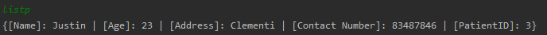

#### Example of usage: 
`editp \age 99 \address Bedok \phone 89993999 \name Justin \index 1`

##### Expected outcome:
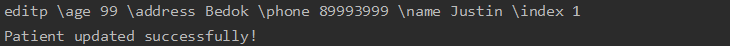
###### Before:

###### After:
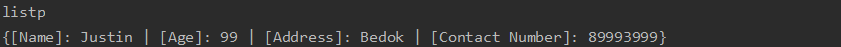

#### Example of wrong usage: 
`editp \index a \address Paris Ris \phone 93489678`

##### Expected outcome:
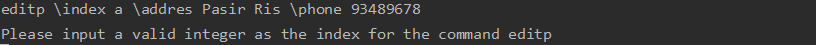

### [Back to top &#x2191;](#table-of-content)

#### 4.1.5 Find an existing patient
The program allows you to find to an existing Patient record based on a search value.

Format: `findp [search value]`

* `findp` keyword
* `search value` followed by a search value.

> 

> 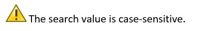

#### Example of usage: 
`findp kurumi`

##### Expected outcome: 
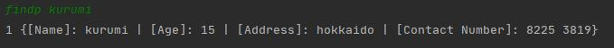

#### Example of no records found:
`findp ayame`

##### Expected outcome:

#### 4.1.6 Clear patient records
The program allows you to clear the patient list. 

Format: `clearp`
* `clearp` keyword

>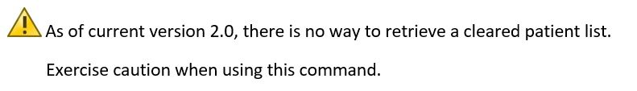

***

### 4.2 Appointment Commands

#### 4.2.1 Add a new Appointment record

The program allows you to add a new Appointment record to the current list of Appointment records. With the addition 
of the `pid` field, it allows users to link the appointment to a specific patient. 

Format: `adda \date [date] \time [time] \pid [patient id]`

* `adda` keyword
* `\date` followed by the date of the appointment
* `\time` followed by the time of the appointment
* `\pid` followed by a unique Patient ID (pid).

> 

> 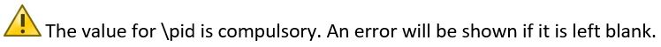

#### Example of usage: 
- `adda \date 14/03/2020 \time 1000 \pid 1`

##### Expected outcome:
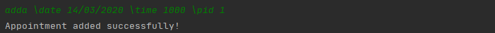

#### 4.2.2 List all existing Appointments

The command simply contains the 'lista' keyword.

Format: `lista`

#### Example of usage: 
`lista`

##### Expected outcome:
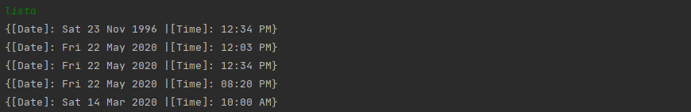

#### 4.2.3 Delete an existing Appointment

The program allows you to delete an existing Appointment record by its index in the list. 

Format: `deletea \index [appointment number in list]`

* `deletea` keyword
* `\index` followed by the index number of the Appointment to be deleted 

Examples of Usage

OK? |   Usage    |   Outcome 
------------- | ------------- | ---------------
OK | `deletea \index 3` | 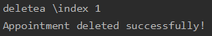
NOT OK | `deletea \index 999` | 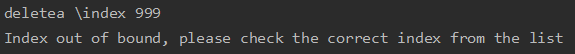

> 

#### 4.2.4 Edit an existing Appointment

The program allows you to make changes to an existing Appointment record by its index in the list.

Format: `edita \index [appointmentNumber] \date [date] \time [time]`
 
* `edita` keyword
* `\index` followed by the index number of the Appointment in the list.
* `\date` followed by the date of the appointment 
* `\time` followed by the time of the appointment

> 

> 

#### Example List
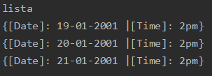

#### Example of usage: 
`edita \index 3 \date 20/05/2021 \time 2300`

##### Expected outcome:
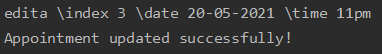

###### Before:
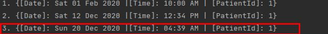

###### After:
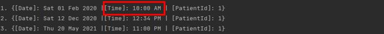

#### Example of usage: 
`edita \index 3 \time 1000 \date 16/03/2020`

##### Expected outcome:
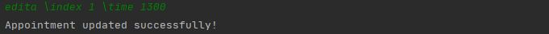

###### Before:

###### After:
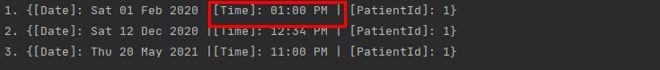

##### Final list:
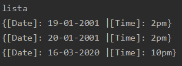

#### 4.2.5 Find an existing Appointment
The program allows you to find to an existing Appointment record based on a search value.

Format: `finda [search value]`

* `finda` keyword
* `search value` followed by a search value.

> 

> 

#### Example of usage: 
 `finda Fri`
 
##### Expected outcome: 
 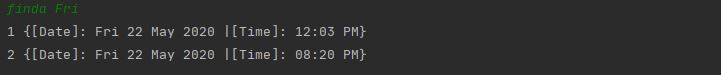
 
#### Example of no records found:
`finda Oct`
 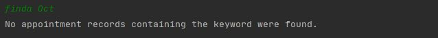

#### 4.2.6 Clear appointment records

The program allows you to clear the appointment list. 

Format: `cleara`
* `cleara` keyword

>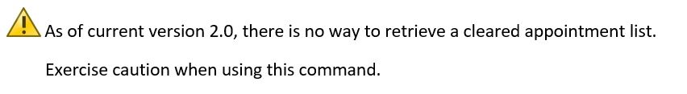

### [Back to top &#x2191;](#table-of-content)

***

## 4.3 Clear all records
The program allows you to clear all lists.

Format: `clearall`
* `clearall` keyword

>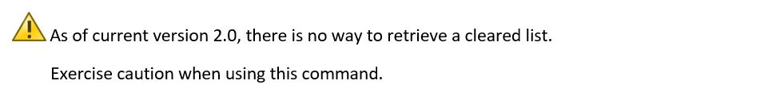 

### 4.4 View help

The 'help' keyword provides you with a list of valid commands, their functions and their proper usages.

Format: `help`

#### Example of usage: 
`help`

##### Expected outcome 
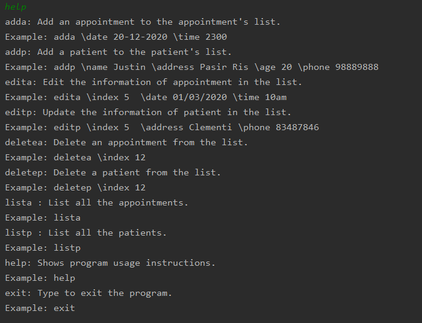

### [Back to top &#x2191;](#table-of-content)

### 4.5 Exit HAMS program

This command exits the HAMS program and saves the current Patient/Appointment data into separate local save files (in
 `/saves/appointments.txt` and `/saves/patients.txt` respectively. Also, the patient id state will also be saved in
  `/saves/patientId.txt`). These files will be loaded to the program when it is run again subsequently.

Format: `exit`
#### Example of usage: 
`exit`

##### Expected outcome: 
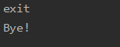

### [Back to top &#x2191;](#table-of-content)

## 5. Command Summary

   Command    |   Description 
   ------------- | ---------------
`adda \date [date] \time [time] \pid [pid]` |  Adds date and time of an appointment and links it to a patient based on their id
`addp \name [name] \age [age] \address [address] \phone [phone]` | Adds name, age, address, and contact number of patient
`finda [search value]`| Searches through all appointment records for the search value
`findp [search value]`| Searches through all patient records for the search value
`lista` | List all the appointments from the appointment's list
`listp` | List all the patients from the patient's list
`cleara`| Clears all appointment records
`clearp`| Clears all patient records
`clearall`| Clears both appointment and patient records
`deletea \index [appointment number in list]` | Delete an appointment by the list's appointment number
`deletep \index [patient number in list]` | Delete a patient by the list's patient number
`edita \index [appointmentNumber] \date [date] \time [time]` | Edit date or time of an appointment by the list's appointment number
`editp \index [patientNumber] \name [name] \age [age] \address [address] \phone [phone]` | Edit date or time of an appointment by the list's appointment number
`help` | Give you a manual on a list of valid commands and their usage
`exit` | Exit the program and save the task into an offline data file (in `/saves/appointments.txt` or `/saves/patients.txt`)

## 6. FAQ
**Q**: Would my details be captured if I randomize the input order of the keywords?

* `addp \phone 12345678 \address NUS \age 22 \name John Doe`
* `addp \name John Doe \address NUS \ age 22 \ phone 12345678`

**A**: Yes. The system is keyword-sensitive. Regardless of the order given, it stores the information within each command used respectively. Both examples provided above would result in the same information stored. 

**Q**: Why does my patient list does not display any value in the age field?

* `{[Name]: Tommy | [Age]:  | [Address]:  | [Contact Number]: 92331234}`

**A**: The age supplied might not be in the correct format (eg age given is a negative number or as a string).

**Q**: Why am I not able to find anything using finda or findp? 

**A**: Please note that all search values are case-sensitive. For example, `Sam` will not match with `sam`
because of the first letter capitalization. 

**Q**: What is `pid` for in the command `adda`?

**A**: `pid` stands for Patient ID, it is a unique ID tag to each patient. In order to link appointments 
to the patient, the pid tag must be present. 

### [Back to top &#x2191;](#table-of-content)

