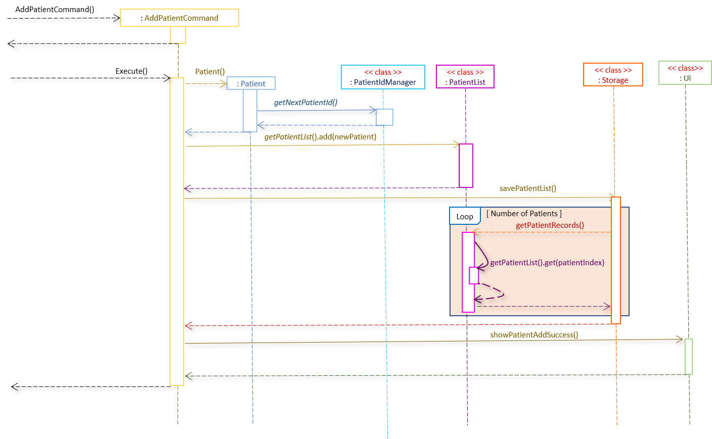
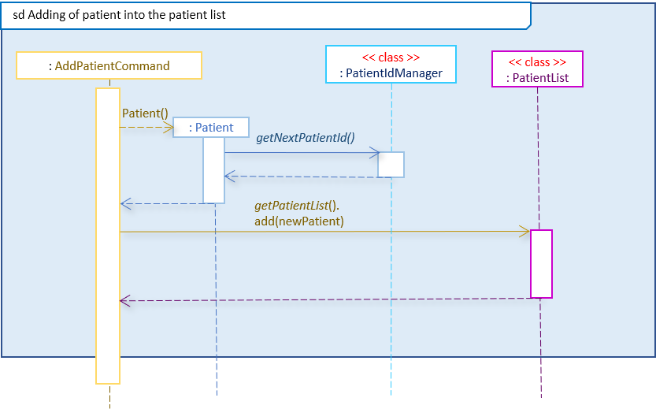
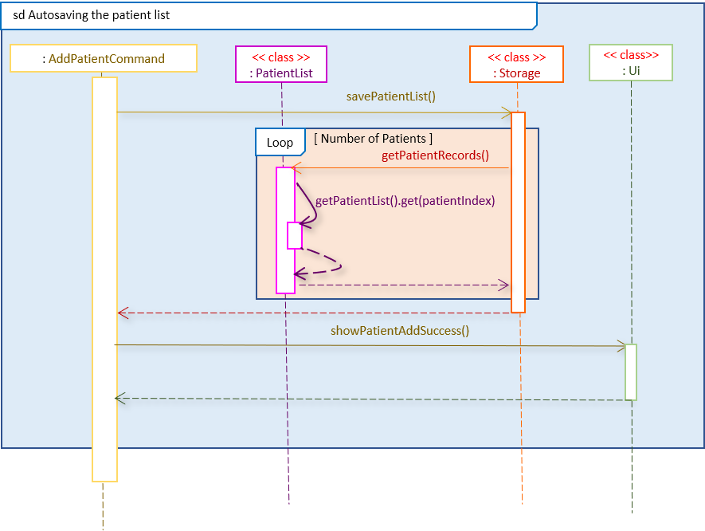
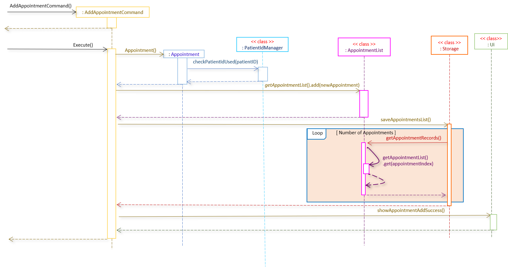
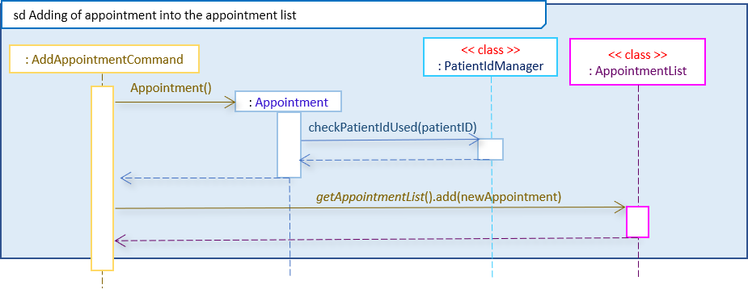
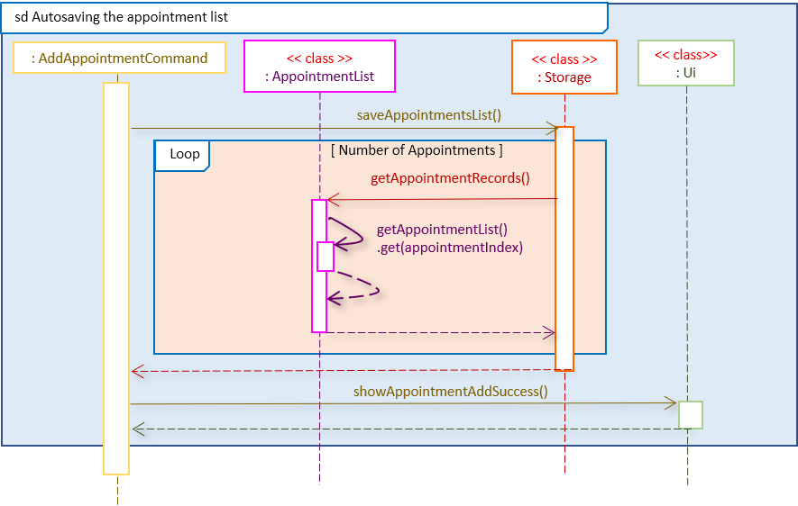
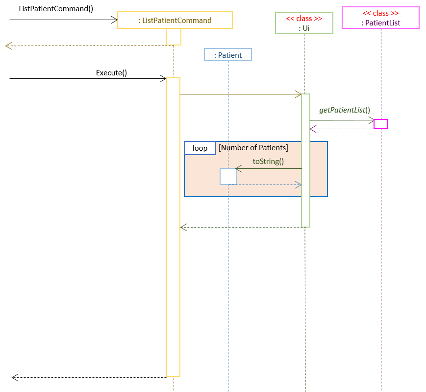
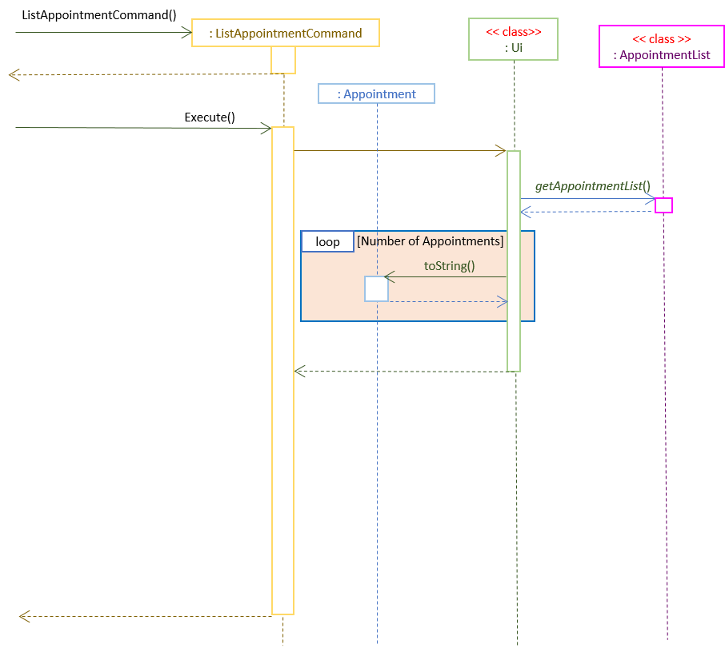

# Andy Aw Bo Yang - Project Portfolio Page

## Overview
Hospital Administrative Management System (HAMS) is a CLI-based medical facility administration system that is used for 
maintaining medical records. It is written in Java

### Summary of Contributions
- **Major enhancement 1:** Added the command classes for add patient (```addPatientCommandClass```), add appointment
 (```addAppointmentCommandClass```), list patient (```listPatientCommandClass```) and list appointment
  (```listAppointmnetCommandClass```).
    - What it does: Serves as a facade class to allow different classes to be able to interact with one another so
     as to be able to execute the adding of commands, appointments as well as listing of patients and appointments
      successfully.
    - Justification: Each of the other classes are very highly cohesive and isolated from one another. The command
     classes, which acts as facade classes, make use of the other classes methods and properties such that the other
      classes can interact with one another to actually execute the user commands.
    - Highlights: The implementation for the commands classes is surprisingly challenging because
      not only do I have to understand how every other classes works, what the classes can do and what their
       intricacies and subtleties are, I also have to figure out how to carefully stitch the different
        functionalities present in the other classes too so as to execute the user's commands. 

- **Major enhancement 2:**  Added a patient id manager to manage the different patient id.
    - What it does: Able to manage the different patient's patient id such as giving new patients a unique patient id
     (be it creating a new patient id or finding and reusing a patient id from a deleted patient) and checking to see if
      a patient id is currently being used by an existing patient.
    - Justification: The patient id uniquely identifies all the patients (serves as a key for the patients). It
     also ensures that patients are linked to appointments.
     - Highlights: Implementation of this class is challenging as both major functions (first function being the
      creating of
      new patient
      id by either creating a new unique id or to find and reuse patient id of deleted patients and the second
       function being the finding and checking of
       patient id that actually exist) has to be quick (preferably in O(1) time) and correct (especially for the solution
        created for the first function as it is quite difficult to prove the correctness of the solution). I managed
         to come up with O(1) solutions for both functions.
     
- **Minor enhancement:** Helped in the creation of the abstract command class that all commands inherits from. Also
 fixed bugs in other classes so that it not only interact correctly with the facade class but also the other classes
  too.
- **Code contributed:** [tP Code Dashboard](https://nus-cs2113-ay1920s2.github.io/tp-dashboard/#breakdown=true&search=andy-aw-why&sort=groupTitle&sortWithin=title&since=2020-03-01&timeframe=commit&mergegroup=false&groupSelect=groupByRepos)

- **Other contribution:** 
	- Project Management:
		- Fixed issues from PE dry run: issues [#93](https://github.com/AY1920S2-CS2113T-T13-3/tp/issues/93), [#109](https://github.com/AY1920S2-CS2113T-T13-3/tp/issues/109), [#113](https://github.com/AY1920S2-CS2113T-T13-3/tp/issues/113), [#123](https://github.com/AY1920S2-CS2113T-T13-3/tp/issues/123) 
	- Documentation:
		- Correct minor typos and formatting issues in the user and developer guide. Also provided the format for the user guide.
	- Enhancements to existing features:
    		- Wrote extensive tests for my command and patientid classes: Pr [#28](https://github.com/AY1920S2-CS2113T-T13-3/tp/pull/28), [#134](https://github.com/AY1920S2-CS2113T-T13-3/tp/pull/134)
	- Community:
		- Reviewed other groups' DG ([example 1](https://github.com/nus-cs2113-AY1920S2/tp/pull/14),[example 2](https://github.com/nus-cs2113-AY1920S2/tp/pull/24))
		- Found bugs for other groups' program ([ped report](https://github.com/andy-aw-why/ped/issues))

### Contributions to the User Guide
```
Given below are some sections I contributed to the User Guide. They showcase my ability to write documentation targeting end-users.
```

# Table of content
<!-- TOC -->

* [1. Introduction](#1-introduction)
    + [1.1. Starting HAMS](#11-starting-hams)
* [2. Features](#2-features)
* [3. Command Format](#3-command-format)
* [4. Command Usage](#4-command-usage)
    + [4.1. Patient Commands](#41-patient-commands)
        + [4.1.1 Add new patient record](#411-add-a-new-patient-record)
        + [4.1.2 List all existing patient records](#412-list-all-existing-patients)
        + [4.1.3 Delete existing patient record](#413-delete-an-existing-patient)
        + [4.1.4 Edit existing patient record](#414-edit-an-existing-patient)
        + [4.1.5 Find existing patient record](#415-find-an-existing-patient)
        + [4.1.6 Clear all patient records](#416-clear-patient-records)
    + [4.2. Appointment Commands](#42-appointment-commands)
        + [4.2.1 Add new appointment record](#421-add-a-new-appointment-record)
        + [4.2.2 List all existing appointment records](#422-list-all-existing-appointments)
        + [4.2.3 Delete existing appointment record](#423-delete-an-existing-appointment)
        + [4.2.4 Edit existing appointment record](#424-edit-an-existing-appointment)
        + [4.2.5 Find existing appointment record](#425-find-an-existing-appointment)
        + [4.2.6 Clear all appointment records](#426-clear-appointment-records)
    + [4.3 Clear all records](#43-clear-all-records)
    + [4.4. Viewing help](#44-view-help)
    + [4.5. Exiting the program](#45-exit-hams-program)
* [5. Command Summary](#5-command-summary)  
* [6. FAQ](#6-faq)  

<!-- /TOC -->

This document serves as a user guide for HAMS. It teaches the user how to install HAMS, describes the features of HAMS, 
explains how HAMS can be used and finally answer some frequently asked questions about HAMS.
 
    
5. In Command Prompt, change your current working directory to the folder containing the .jar using $ `cd <Path of folder containing .jar>`


This command exits the HAMS program and saves the current Patient/Appointment data into separate local save files (in
 `/saves/appointments.txt` and `/saves/patients.txt` respectively. Also, the patient id state will also be saved in
  `/saves/patientId.txt`). These files will be loaded to the program when it is run again subsequently.
  
  **Q**: Why does my patient list does not display any value in the age field?
   
  * `{[Name]: Tommy | [Age]:  | [Address]:  | [Contact Number]: 92331234}`
   
  **A**: The age supplied might not be in the correct format (eg age given is a negative number or as a string).
  
  
### Back to top &#x2191;

- My contribution are mostly fixes in typos and aesthetics (such as adding a ```back to top``` link). This is because
 the user guide for HAMS is actually my DUKE ip's user guide only slightly modified to fit HAMS. In a sense
 , I technically created the user guide while my teammates modified it to fit HAMS.
 
### Contributions to the Developer Guide
```
 Provided below are some sections I contributed to the Developer Guide. They demonstrate my ability to communicate my 
 technical contributions to the project and rationale for technical implementation.
```

#### 2.2.4 A&D command module 

##### 2.2.4.1 AddPatientCommand Class

Below shows the sequence diagram for ```AddPatientCommand``` class






 

##### 2.2.4.2 AddAppointmentCommand Class


Below shows the sequence diagram for ```AddAppointmentCommand``` class:







##### 2.2.4.3 ListPatientCommand Class

Below shows the sequence diagram for ```ListPatientCommand``` class



##### 2.2.4.4 ListAppointmentCommand Class




##### 2.2.4.6 Design considerations

For the 5 classes listed, there were some other design considerations that was discussed for these 5 classes. Here
, we will discuss the other choices and the pros and cons for them.

###### 2.2.4.6.1 Aspect: Facade classes
+ Alternative 1 (current choice): Making all 4 classes facade classes
   
   * Pros: 
        - Stronger Single Responsibility Principle (SRP) and Separation of Concerns Principle (SoC)
   
   * Cons:
        - Higher dependencies and couplings on the other classes to work.

+ Alternative 2: Put the actual adding logic into the classes

    * Pros:
        - Weaker dependency and couplings on the other classes
    
    * Cons:
        - Lower SRP and (SoC)

###### 2.2.4.6.2 Aspect: Autosaving or no

+ Alternative 1 (current choice): Allow for autosaving after each command execution
    * Pros: 
        - Allow for recovery when crashing
        - Negligible performance effect on higher end computer system
       
    * Cons:
        - Since saving is writing to disk, it may be an expensive process for weaker computer system. Weaker computer system may be slowed down by the constant saving

+ Alternative 2: Save only when exiting HAMS
    * Pros: 
        - Faster, especially for weaker computer systems
       
    * Cons:
        - No recovery (or rather, no recovery for recent information) when HAMS crashes 

###### 2.2.4.6.3 Aspect: Generation of Patient Id

+ Alternative 1 (current choice): Allow the reuse of the patient Id from deleted patients
    * Pros: 
        - Allow for reuse, which prevents the patient Id number from running out.
       
    * Cons:
        - Slightly more complicated implementation. Also it means that there is more information that is required to be saved (such as the list of patient Id to be reused) when HAMS shuts down.

+ Alternative 2: Always pick a new number (don't reuse deleted patient Id number)
    * Pros: 
        - Easier to implement and keep track of. Also, it does not need to save much more information about the patient Id numbers (just need to save the last number assigned).
       
    * Cons:
        - Much more likely to run out of patient id numbers, especially if patients are getting added and deleted from HAMS continuously and consecutively.
        
###### 2.2.4.6.4 Aspect: Deciding how to reuse Patient Id

+ Alternative 1 (current choice): For reusable patient id, just choose the patient id number that have not been
 assigned the longest
    * Pros: 
        - Easy to implement (just use a Queue) and ensures an O(1) time.
    * Cons:
        - Patient id number is not really in sequence (it is possible for a bigger patient id number might be assigned
         first before a smaller patient id number). As a result, the new patient id number is not that predictable
          (unless you are keeping track of which patient id numbers are deleted first).

+ Alternative 2: Sort the reusable patient id first such that the smallest patient id is always reused first 
    * Pros: 
        - Patient id number is in sequence (always assign the smaller patient id number first), which seems to make
         it easier to predict the next patient's patient id number.
    * Cons:
        - Sorting is O(n log n) time, hence making it slightly slower than current implementation.
