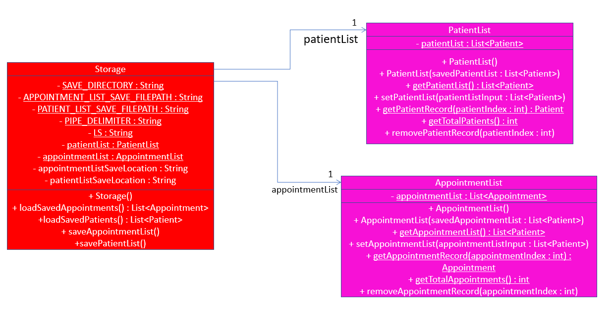
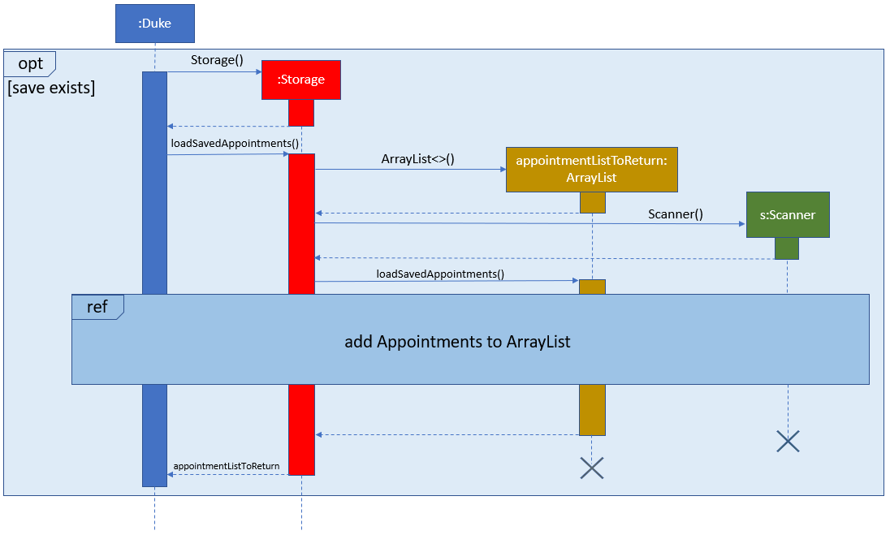
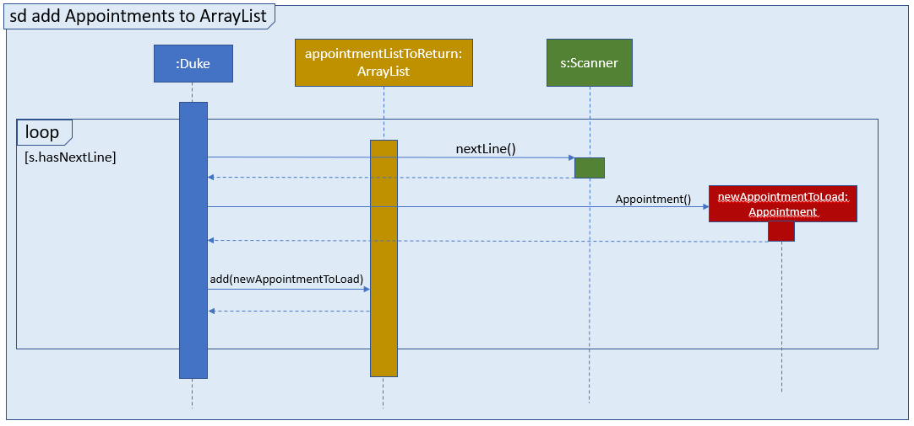
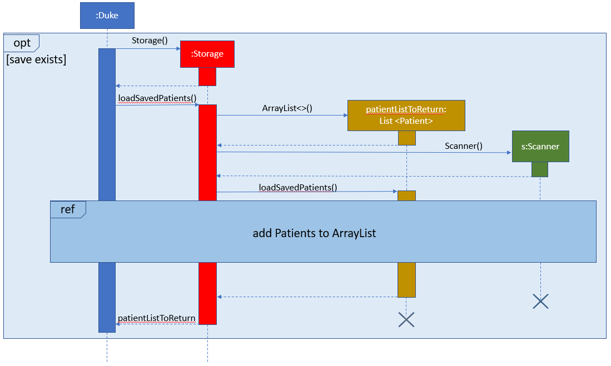
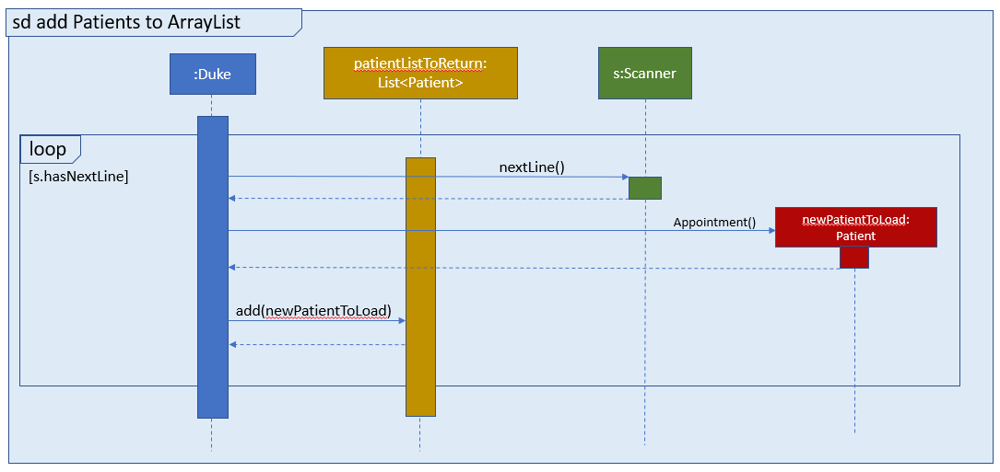
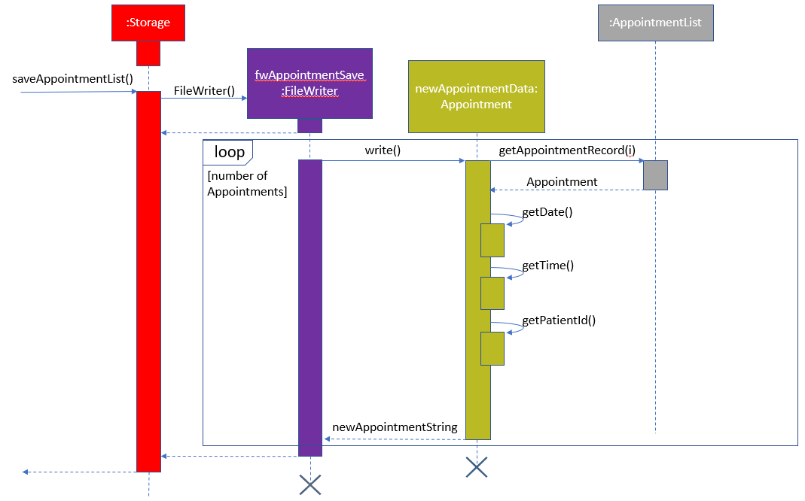
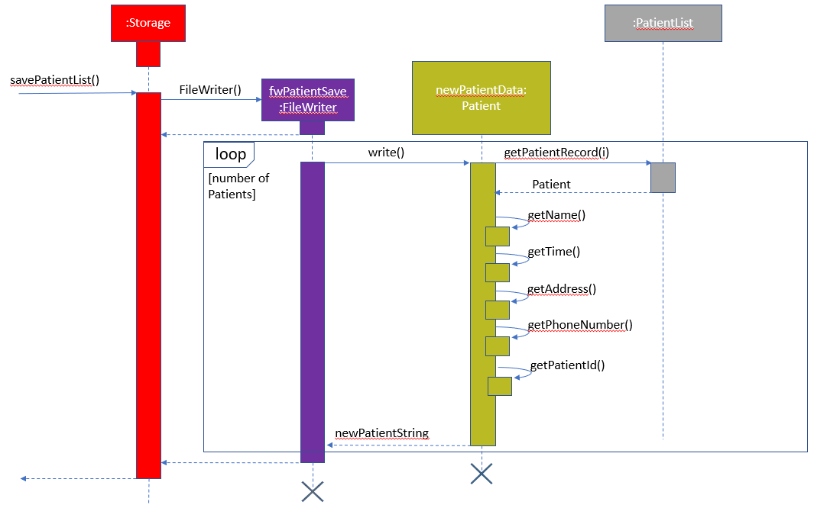
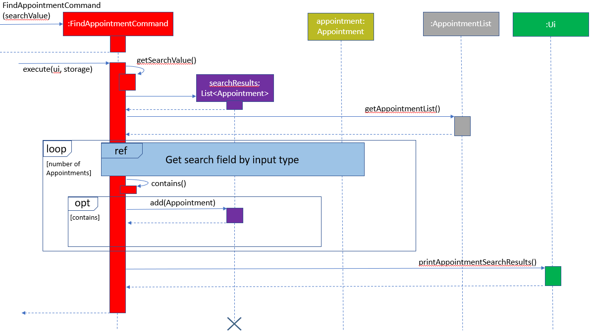
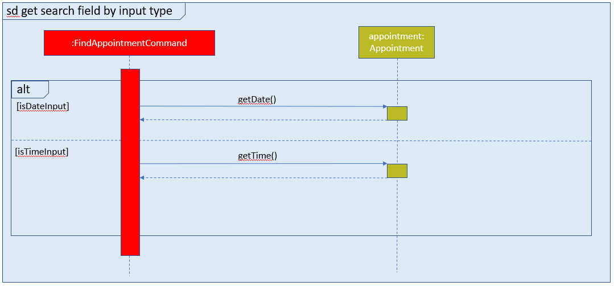
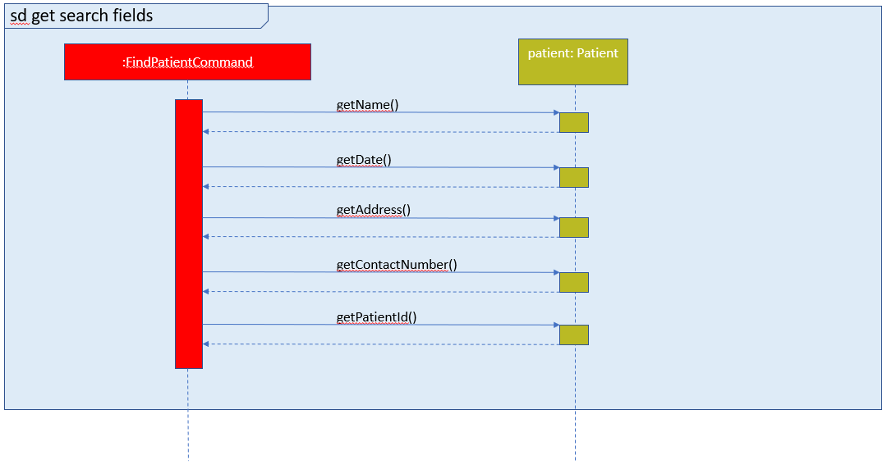

# Brandon Chong - Project Portfolio Page

---

## Overview
### Project: Hospital Management System v2.0
Hospital Administrative Management System - HAMS is a CLI-based medical facility administration system that assists in the maintenance of various medical records. 

HAMS is designed for administrative assistants in medical facilities, like hospitals or polyclinics, that *prefer using
CLI to keep track of various medical records* and *can type fast*.

### Summary of Contributions

- **Major Enhancement 1**: Implemented the `Storage` class.

    - *What it does*: Backs up existing `Patient` and `Appointment` record data, that are stored in the `PatientList` and 
    `AppointmentList` objects respectively, to local .txt save files upon adding/editing of information or upon exiting 
    the program. It also parses the two types of saved record data from the .txt files into the `PatientList` and 
    `AppointmentList` when starting up the program.
   
    - *Justification*: This increases the usability of the program by enabling data to exist beyond the execution lifetime 
    of the program. Previously created `Patient` and `Appointment` records can be easily referenced and accessed through 
    the program without having to manually store the data by oneself. 
    
    - *Highlights*: 
    
        - The current implementation utilises a folder `saves` in the directory where the .jar file of HAMS is located. This 
        folder contains the .txt files that will be used to store the information of existing `Patient` and `Appointment`
        objects separately.
          
        - It is necessary to consider how the `saves` folder contents may be affected by external factors, which may cause it to 
        deviate from its intended behaviour. For instance, the files could have been deleted, or simply not exist (if the user
        is running HAMS for the first time). Moreover, malicious entities may render the files unreadable, for example by manually 
        removing from the file the separators that the methods in `Storage` uses to parse the data. 
        
          The `loadSavedPatients` or `loadSavedAppointments` methods which are involved in converting the .txt file data
          to `Patient`/`Appointment` records in the program itself and invoked on program startup thus utilise exceptions
          and clause checks to ensure the program can continue to run smoothly. If the file does not exist, the methods will create them 
          on startup. If the file is corrupted, the methods will delete the file and recreate it.
          
        - Ultimately, the aforementioned methods allow `Storage` to convert individual lines from the .txt files, each
        representing a different record, to `Patient`/`Appointment` objects and add them to `PatientList`/`AppointmentList`
        respectively so that after startup, the list of current Patients and Appointments are available for the user
        to peruse.

     
- **Minor Enhancement 1**: Implemented find commands for both Patients `(findp)` and Appointments `(finda)`.

&nbsp;

- **Code contributed:** [tP code Dashboard](https://nus-cs2113-ay1920s2.github.io/tp-dashboard/#breakdown=true&search=brandoncjh&sort=groupTitle&sortWithin=title&since=2020-03-01&timeframe=commit&mergegroup=false&groupSelect=groupByRepos)

- **Other contributions:** 
    
    - Project management:
        
        - Managed v1.0 HAMS release on Github
    
    - Documentation:
    
        - Developed User Guide (UG) draft for HAMS v1.0
            - See: [1](https://github.com/AY1920S2-CS2113T-T13-3/tp/pull/39), [2](https://github.com/AY1920S2-CS2113T-T13-3/tp/pull/42)
        - Developed Developer Guide (DG) documentation for Storage and FindPatientCommand/FindAppointmentCommand classes

    - Community:
    
        - Reported bugs and suggestions for other teams in the class 
            - See: [1](https://github.com/brandoncjh/ped/issues), [2](https://github.com/nus-cs2113-AY1920S2/tp/pull/4/files/3c632f30ad42dbc770079d0ea5da26929b52fbed)
        - Engaged in class forum to help answer other classmates' general queries
            - See: [1](https://github.com/nus-cs2113-AY1920S2/forum/issues/78#issuecomment-599041742), [2](https://github.com/nus-cs2113-AY1920S2/forum/issues/81#issuecomment-600406106)
        


## Contributions to the User Guide
```
Given below are sections I contributed to the User Guide. They showcase my ability to write documentation targeting end-users.
```
> I provided the writeup for the Introduction section, which includes the Quick Start guide for HAMS.
>
> In the Features secction, I also elaborated on key features of the product that would help to assist the user in their tasks.

## 1. Introduction

This document serves as a user guide for HAMS. It teaches the user how to install HAMS, describes the features of HAMS, 
explains how HAMS can be used and finally answer some frequently asked questions about HAMS.
 
HAMS is a CLI-based medical facility administration system that assists in the maintenance of various medical records. 

HAMS is designed for administrative assistants in medical facilities, like hospitals or polyclinics, that *prefer using
CLI to keep track of various medical records* and *can type fast*.

***
    
### 1.1 Starting HAMS
1. Ensure you have JDK 11 installed on your computer. You can download the installer for your OS from [here](https://www.oracle.com/java/technologies/javase-jdk11-downloads.html).
2. Download the latest .jar file release for HAMS from [GitHub](https://github.com/AY1920S2-CS2113T-T13-3/tp/releases).
3. Move the .jar to an empty folder.
4. Open Command Prompt.
5. In Command Prompt, change your current working directory to the folder containing the .jar using $ `cd <Path of folder containing .jar>`
6. Run the .jar using $ `java -jar (latest version).jar`

### [Back to top &#x2191;](#table-of-content)
 
&nbsp;

***

## 2. Features

#### Keep track of different record types
HAMS provides you with an easy-to-use system that helps manage and keep track of two types of medical records: *Patients* and *Appointments*.

#### View all your tasks
The `lista` or `listp` command that HAMS provides can display all the Appointment or Patient records within the system in a readable format.

#### Auto-save and store these records
HAMS has an auto-save feature which stores Patient and Appointments every time you add or modify them. 
With this feature, your tasks will be saved every time you leave the application and can be easily retrieved when you reopen the application subsequently.

### [Back to top &#x2191;](#table-of-content)

&nbsp;

***

&nbsp;

***

## Contributions to the Developer Guide
```
 Provided below are sections I contributed to the Developer Guide. They demonstrate my ability to communicate my 
 technical contributions to the project and rationale for technical implementation.
```
> I developed the Storage module, listing out the main purpose and steps in input interpretation.
#### 2.2.3 Storage module

The Storage module consists of 3 different classes. 
The PatientList and AppointmentList classes act as data structures to store the records of Patient and Appointment 
objects respectively. They function as ADTs, where various commands from Command objects can manipulate the records within.

The Storage class manages the load and save operations involving the PatientList and PatientList class. 
These operations are usually invoked on startup, whenever changes are made to the ADTs and before exiting the program.
Additionally, it also works with PatientIdManager class to load pre-existing Patient-PatientId mappings.
The class diagram for the storage module is as seen below: 




&nbsp;

##### 2.2.3.1 Process of Object Creation

On startup, Duke invokes the `loadSavedAppointment()` and `loadSavedPatient()` methods in Storage. This allows the program 
to retrieve previously stored data from a .txt file and convert it into the static AppointmentList and PatientList objects for use
within the program. 

For Appointments, the Storage object creates a Scanner object that will parse individual lines in the .txt file, convert them into
new Appointments, and then add them to an ArrayList of Appointments called `appointmentListToReturn`. This `appointmentListToReturn` will be passed back to Duke to
construct the static AppointmentList.
 
For Patients, the process is the same as above. The difference is that lines in the .txt files are converted to Patient objects instead.
They are added to an ArrayList of Patients called `patientListToReturn`. `patientListToReturn` is then passed back to Duke to construct
the static PatientList.

The sequence diagrams for both `loadSavedAppointment()` and `loadSavedPatient()` are shown below:







When the static AppointmentList or PatientList has changes, or the program is exiting, `saveAppointmentList()` or `savePatientList()` 
is invoked respectively. This allows the Storage object to back up existing records to a local .txt file.

For Appointments, the Storage object will create a FileWriter object called `fwAppointmentSave`. The command will then iterate through the existing AppointmentList
and parse each Appointment within, converting it to a string. `fwAppointmentSave` then writes this string to the .txt file `appointments.txt`.

For Patients, the process is the same as above. The difference is that Storage object creates a FileWriter object called `fwPatientSave` instead.
`fwPatientSave` writes Patient strings to the file `patients.txt`.

The sequence diagram for `saveAppointmentList()` and `savePatientList()`  is shown below:




> I developed the FindPatientCommand and FindAppointmentCommand classes, listing out the main purpose and steps in input interpretation. 
> 
>Additionally, I also provided design considerations while implementing this module.

#### 2.2.4.14 FindAppointmentCommand Class

To search the `AppointmentList` by keyword, the `FindAppointmentCommand` class is used. For this class, it serves as a 
facade class for the Main, AppointmentList, Ui and the Storage class to interact with one another.

1.	The `FindAppointmentCommand` class is processed by Parser

2.	When the Main calls `execute(Ui ui, Storage storage)`, it creates `searchResults`, a new List to hold `Appointment` objects. 

3.	The `FindAppointmentCommand` class gets the existing list of Appointment objects from AppointmentList using the method 
`getAppointmentList()`.

4.	After which, the `FindAppointmentCommand` object will iterate through Appointment objects within the list. According
to the format of the input, this class searches specific fields:
        * if input was **dd/mm/yyyy**, it searches date fields of each Appointment only.
        * if input was **hh:mm (am/pm)**, it searches time fields of each Appointment only.

5.	If an Appointment object does contain the search keyword, it will be added to searchResults.

6.	searchResults then invokes the ui method `printAppointmentSearchResults()` to print the matching Appointment results to the console.
(if searchResults is non-empty). Otherwise, the method outputs a message saying no search results were found.

Below shows the sequence diagram for FindAppointmentCommand class.




##### 2.2.4.14.1 Design Considerations
###### Aspect: Format of Search Input

+ Alternative 1 (current choice): Search only by Time or Date input
    * Pros: 
        - Easier implementation
        - Greater compatibility with TimeConverter class, able to validate input more easily
    * Cons:
        -  Unable to filter existing Appointments more efficiently to find a specific Appointment

+ Alternative 2: Support multiple fields with specific delimiters (eg. `finda \date 01/04/2020 \time 01:00 PM`)
    * Pros:
        - Allows us to be more specific when filtering and searching for a certain Appointment.
    * Cons:
        - Not as compatible with TimeConverter class. Requires more sophisticated methods to parse input, as well 
        as error handling to handle complicated error cases for multiple input fields.

#### 2.2.4.15 FindPatientCommand Class

To search the `PatientList` by keyword, the `FindPatientCommand` class is used. For this class, it serves as a 
facade class for the Main, PatientList, Ui and the Storage class to interact with one another.

1.	The `FindPatientCommand` class is processed by Parser

2.	When the Main calls `execute(Ui ui, Storage storage)`, it creates `searchResults`, a new List to hold `Patient` objects. 

3.	The `FindPatientCommand` class gets the existing list of Patient objects from PatientList using the method 
`getPatientList()`.

4.	After which, the `FindPatientCommand` object will iterate through Patient objects within the list. This class searches
through every field in the Patient object for the search keyword.

5.	If a Patient object does contain the search keyword, it will be added to searchResults.

6.	searchResults then invokes the ui method `printPatientSearchResults()` to print the matching Patient results to the console.
(if searchResults is non-empty). Otherwise, the method outputs a message saying no search results were found.

Below shows the sequence diagram for FindPatientCommand class.




##### 2.2.4.15.1 Design Considerations
###### Aspect: Format of Search Input

+ Alternative 1 (current choice): General search (search value across all fields)
    * Pros: 
        - Easier implementation
    * Cons:
        -  May be relatively slower in obtaining search results due to complexity of this method

+ Alternative 2: Support multiple fields with specific delimiters (eg. `findp \name Bob \address Bukit Batok Ave 2`)
    * Pros:
        - Allows us to be more specific when filtering and searching for a certain Patient
    * Cons:
        - Requires us to manage the different possible combinations of fields in the input (there are 4 fields, resulting in
        24 possible combinations). We would need additional clauses and exceptions to handle the increased complexity of this input.
