# Tan Zheng Fu Justin - Project Portfolio

## Overview
Hospital Administrative Management System (HAMS) is a CLI-based medical facility administration system that is used for 
maintaining medical records. It is written in Java.

### Summary of Contributions

- **Major Enhancement 1**: implemented the logic for `Parser`.

    - What it does: Interprets the User's input so that the correct command can be executed. It also functions
    as the first line to sanitize user input.
   
    - Justification: As the backbone of the program, it potentially interacts with all of the commands. As such, the correct
    format and values should be given to these commands for execution.
    
    - Highlights: 
    
        - The current implementation allows Users to input the format in any order, as long as it is an accepted format.
          For Example, for the valid command: `addp` and accepted formats `\name` and `\age`, both commands below will 
          yield the same outcome.
      
          Command 1: `addp \name Justin \age 24`
          
          Command 2: `addp \age 24 \Justin`
          
        - There is a need to analysis and think in terms of User behaviour as there is no telling what the User will input 
          into the command line. This aspect makes it challenging, as various circumstances from the user's point of view
          needs to be considered. 
          
          For example, what if the users did not provide any formats? What if the users provide the formats but did not
          give any values? What is the index provided is not an integer? These questions then have to be converted into
          codes and custom exceptions for each situation has to be created. 
          
        - Ease of maintainability and upgrade. The Parser has a modular design, all different commands are handled in
          different methods. This allows separation of work and makes it easy for any future developers to modify anything.
          
          In addition, with regards to future upgrades, additional formats might be introduced, such as `\bloodtype` 
          when adding a patient. It is extremely easy to add new formats into the Parser class due to its modularity. 
          Simply add the requires field into the correct enum, and the Parser will loop through the enum to find the 
          required formats inside. 

&nbsp;
    
***
     
- **Major Enhancement 2**: implemented the `DukeExceptions` for error checking.
    
    - What it does: `DukeExceptions` acts like a public class with methods to call to check the parameters for correctness.
    
    - Justifications: It abstracts out lengthy checks for classes that class `DukeExceptions's` methods. This reduces code 
    duplication and increases abstraction.
    
        For example: 
    
        `DukeExceptions.checkIndexValidity(indexValue, String);` is a one liner called for different commands to check if
         the index is valid. If it is not abstracted out, then there will be duplicated code blocks.
    
    - Highlights: 
    
        - It is easy to add new checks and exceptions, since all checks in DukeExceptions are public methods. These 
        methods can then throw custom exceptions if the parameters being checked is wrong. 
        
        - For custom exceptions, I utilized overriding the getLocalizedMessage method. This then allows me catch a general
        exception and then print `exception.getLocalizedMessage()` instead of making creating custom print message. This 
        method is good because all error messages are located in their specific custom exception class instead of it 
        being printed in one class or area. 

- **Minor Enhancement** added ui that does most of the printing to user. 

- **Code contributed:** [tP code Dashboard](https://nus-cs2113-ay1920s2.github.io/tp-dashboard/#breakdown=true&search=justinnt&sort=groupTitle&sortWithin=title&since=2020-03-01&timeframe=commit&mergegroup=false&groupSelect=groupByRepos)

- **Other contribution:** 
    
    - Project management:
        
        - Managed v2.0 release on Github
    
    - Documentation:
    
        - Fixed issues regarding UG after PE-D [Pull requests #132](https://github.com/AY1920S2-CS2113T-T13-3/tp/pull/132)
        - Added and maintain warning and hint pictures for UG [#132](https://github.com/AY1920S2-CS2113T-T13-3/tp/pull/132) [#156](https://github.com/AY1920S2-CS2113T-T13-3/tp/pull/156)  

    - Community:
    
        - Reported bugs and suggestions for other teams in the class [Example: 1,](https://github.com/JustinnT/ped/issues) [2](https://github.com/nus-cs2113-AY1920S2/tp/pull/28)
        - Liaise with another team to review their program. 
        
## Contributions to the User Guide

> Given below are sections I contributed to the User Guide. They showcase my ability to write documentation targeting end-users.

**For 3. Command Format, I ensured that the commands and examples are up to date. I also included in visual hints (pictures) that
can be useful for Users.**

## 3. Command Format

Words enclosed within angle brackets `[]` are the parameters to be supplied by the user. Other keywords stated are 
compulsory and they should be included.

For example, in `adda \date [date] \time [time] \pid [patient id]`, `adda` is the command keyword that adds an 
Appointment record. 

`\date` and `\time` are compulsory labels to denoting what field the subsequent information belongs to.
`[date]` is the date of the appointment to be supplied by you. `[time]` represents the time of the appointment to be 
supplied by you.

A valid input would be `adda \date 22/05/2020 \time 1200 \pid 1`.

> 

> 

> 

&nbsp;

***

**For the below UG snippet, I placed moved all command examples to table form, as well as providing a "Before" and "After" list for
the user to reference.**
 
#### Example List (Before)
 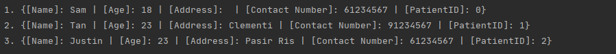

#### Examples of usage:

**Please refer to the above "Before" list to compare the changes.**

OK? |   Usage    |   Outcome & After |
------------- | ------------- | --------------- |
OK | `editp \index 2  \name Lam \phone 83487846` | 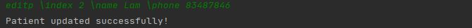  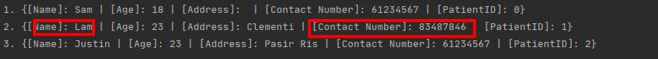 
OK | `editp \age 99 \address Bedok \phone 89993999 \name Justin \index 3` |  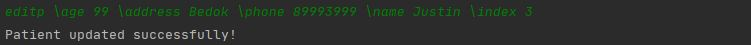 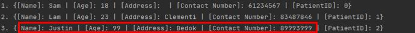
NOT OK | `editp \index a \address Paris Ris \phone 93489678` | 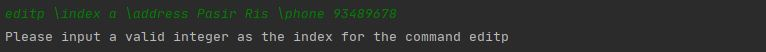 

#### Final List 
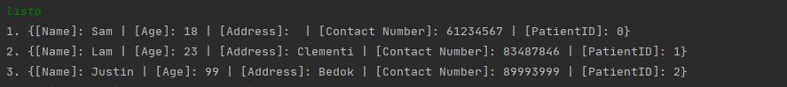

&nbsp;

***

**The below parts are not in the User Guide but are some additional features and designs I would like to propose**

### Handling of duplicate fields

#### Current implementation: 

#### Proposed implementation:
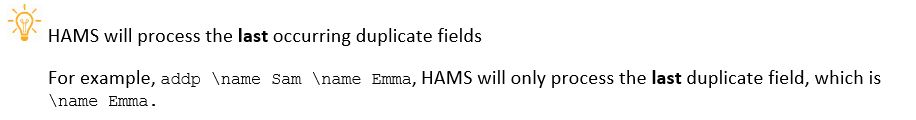

Context: The user has typed a lot of stuff, and realizes that somewhere at the 
front he had a typo. So instead of retyping the commands, he can simply duplicate the header with the correct information.

{Explain how and why the user might want to take advantage of this feature}

&nbsp;

***

## Contributions to the Developer Guide

> Provided below are sections I contributed to the Developer Guide. They demonstrate my ability to communicate my 
 technical contributions to the project and rationale for technical implementation.

**I provided the write up for the introduction part of the Developer Guide as shown below**

## 1. Introduction

### 1.1. Purpose
This document specifies the architecture and software designs for 
Hospital Administrative Management System (HAMS).

### 1.2. Product Scope
#### 1.2.1. Target User Profile
The intended audience of this documentation are the developers, designers, software testers,
operators and maintenance engineers. The below table summarizes the purposes of reading for each 
audience.

|Role|Purpose|
|---------|-------|
|Developers & Designers| To understand the architecture and follow the design to build the system|
|Software testers| To understand the internals of the system so as to test more effectively|
|Operators| To improve productivity while using the system on a daily basis|
|Maintenance Engineers| To understand how the system was built in order to perform enhancement or re-engineering work|

&nbsp;

***

**I developed the Parser module, listing out the main purpose and steps in input interpretation. At the end of the section,
I provided design considerations while implementing this module.**

#### 2.2.5 Parser module
This section describes the implementation of Parser class, as well as the design considerations and rational behind the 
current implementation.

The main purpose of the Parser class is as below.
1.  To interpret user inputs so that the correct command can be executed 
2.  Functions as the first line to sanitize user input

As such, the Parser class only has one publicly callable method and that returns the command object for execution. 
To assist the public method, Parser class has multiple private helper methods, as well as access to the Exception handler
to ensure that the user input is formatted correctly. This way, purpose 1 and 2 is satisfied. 

##### 2.2.5.1 Object creation and steps in input interpretation
1.  The `Parser` object is first created in `Duke` class and subsequently used until program termination.
2.  User input is received and handed over to `Parser` object for interpretation.
3. In the `Parser` object, the type of command is first determined via helper method `getCommand(userInput)`.
    + Example: `addp \age 23 \name Justin`, the `addp` command will be determined.
4. The remaining fields will be recorded in a hashMap through either `fillPatientFields(userInput)` or `fillAppointmentFields(userInput)`
depending on the command type in Step 3.
    + The type of category of the command can be determined based on the last alphabet of the first word. 
    + The command `addp` has the last alphabet is `p`, `fillPatientFields()` will be called. 
    Likewise, if it ise `adda`, it will be `fillAppointmentFields()`.
    + Example: `addp \name Sam \age 18`, the method `fillPatientFields(userInput)` will be called. The hashMap will contain
    age -> 23, name -> Sam. 
5. At the end of the execution, a reference to the command object will be returned. 

>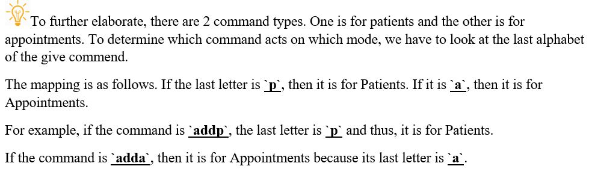

>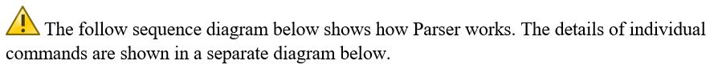

Sequence Diagram when `parseCommand(userInput)` is initially called
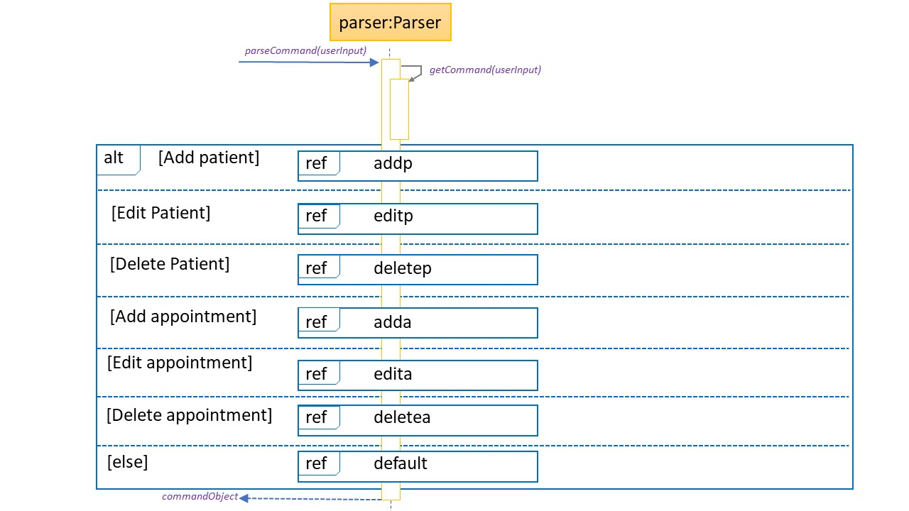

Sequence Diagram for `addp`
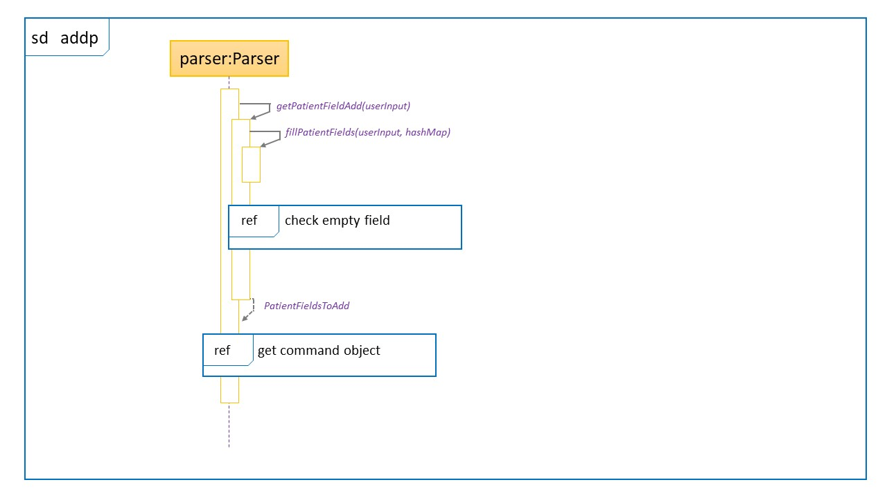

Sequence Diagram for `editp`
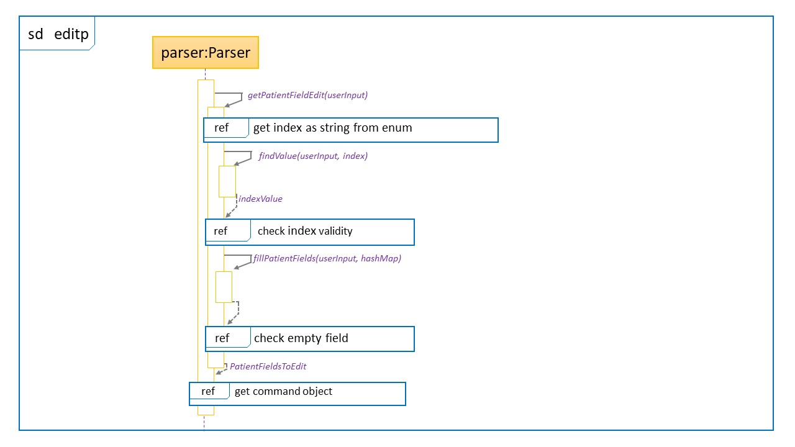

Sequence Diagram for `deletep`
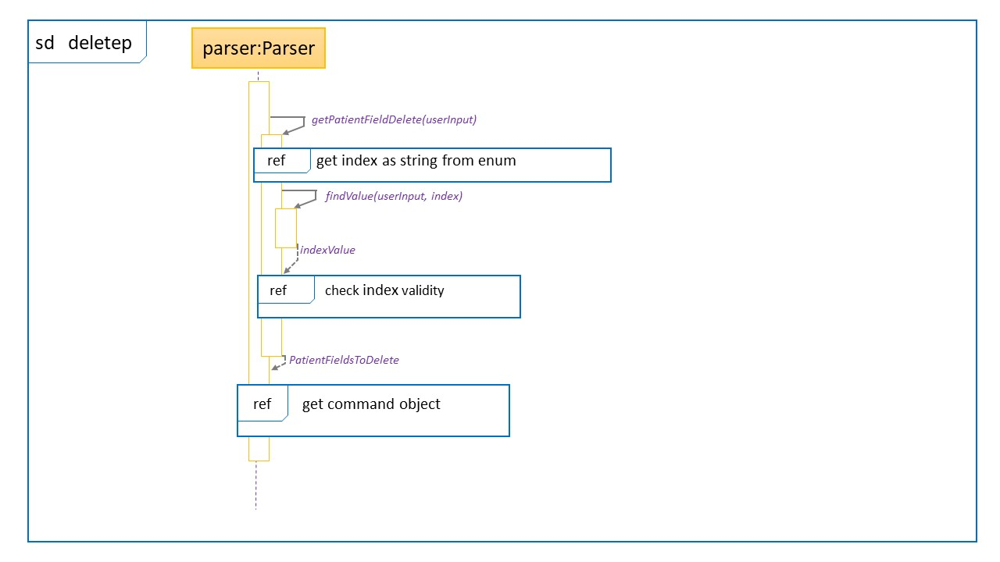

Sequence Diagram for `adda`
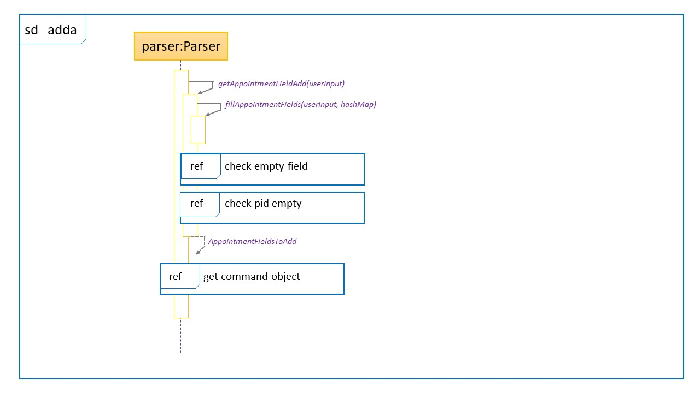

Sequence Diagram for `edita`

Sequence Diagram for `deletea`

Sequence Diagram when it is an unknown command
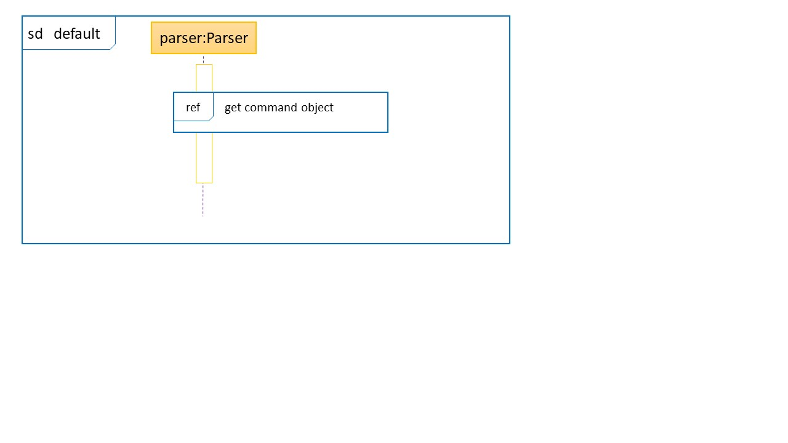

Sequence Diagram for the creation of the command Object

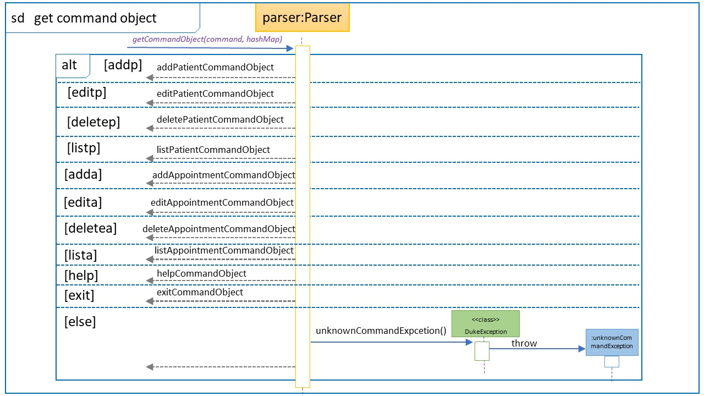

Sequence Diagram for error checking when `DukeExpcetion` is called

Sequence Diagram for calling an enum

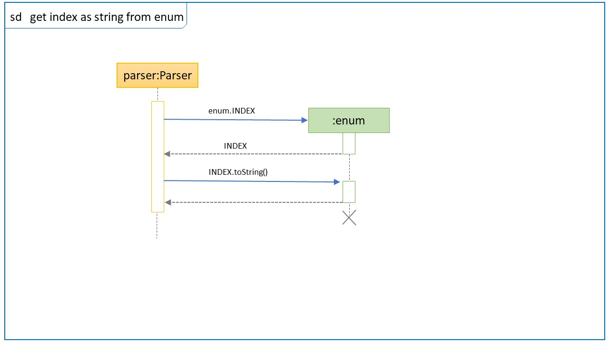

Sequence Diagram for error checking when `DukeExpcetion` is called

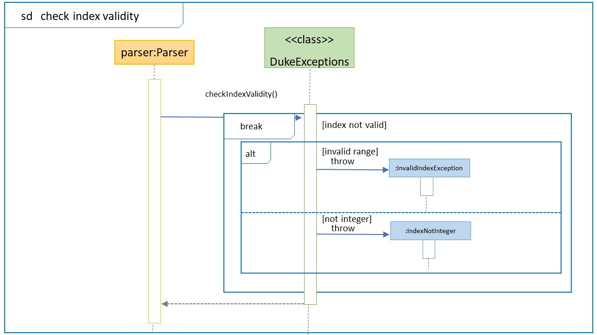

>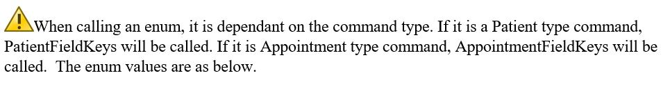

|Enum|PatientFieldKeys|AppointmentFieldKeys
|--------|-------|------|
|.|INDEX|INDEX|
|.|NAME|DATE|
|.|AGE|TIME|
|.|ADDRESS|.|
|.|CONTACT_NUMBER|.|

>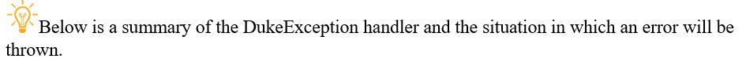

|DukeExceptions|checkFieldEmpty|checkIndexValidity
|--------|-------|------|
|.|Based on the above enum table, checks that at least 1 field  is provided.   Throws NoFieldCommandException if all fields are empty|Check that the index provided is valid.    If it is less than 0 or not an integer, throw InvalidIndex and IndexNotInteger respectively.|

##### 2.2.5.2 Design considerations
###### Aspect: Symbol for delimiter
+   Alternative 1 (current choice): Backslash `\` is used. 
    *   Pros: 
    
        -   Backslash is the least used symbol in the english language.
        
    *   Cons: 
    
        - More caution must be exercised to used backslash in computer language as REGEX uses it as a delimiter by
          default.
          
        - Might break the speed at which user type since backslash is located where it would be hard to reach with
          regular typing. 

+   Alternative 2: Slash is `/` used.
    * Pros:
    
        - easier to access when typing
        
    * Cons:
    
        - some people may have a slash in their legal name - `Suresh S/O Ravindran`
     
###### Aspect: Symbol for delimiter
+   Alternative 1 (current choice): Each command will call its own method to parse field. 
    *   Pros: 
    
        -   Decouples commands from method, making the code more modular.
        -   Increases testability, bugs found can be isolated to the individual command and method respectively
        -   Changes to one method will only affect the command calling it and vice-versa.
        
    *   Cons: 
    
        -   Code duplication will increase
 
+   Alternative 2: Every command calls a common method to parse the remaining fields. 
    * Pros:
    
        -   Less code duplication
        
        -   Easier to understand code. 
        
    * Cons:
    
        - Leads to tighter coupling
        
        -   All command depends on this common method to parse fields, if the method changes, it may return the wrong
        result for some commands. 